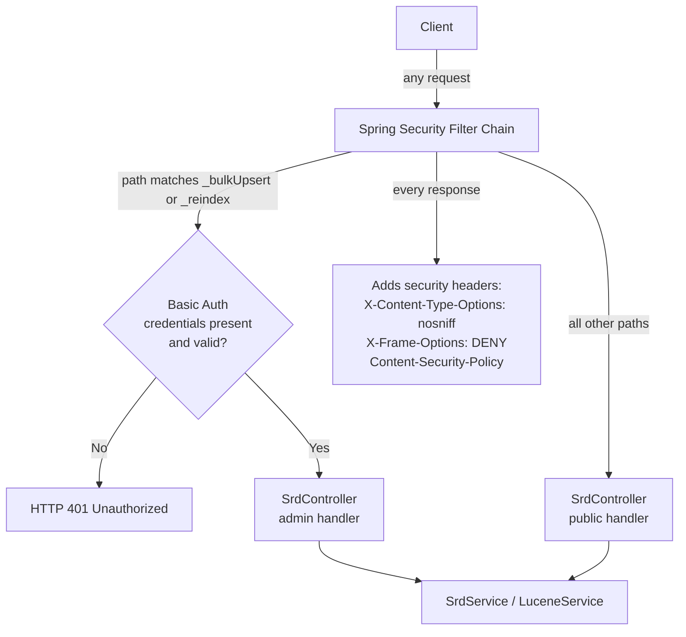

# ADR-001: Spring Security for Admin Endpoint Protection

> **Status:** `Accepted`
> **Date:** 2026-05-13
> **Backlog item:** PBI-001
> **Decider:** Architecture Agent → 👤 Human approval required

---

## Context

The backend currently has no authentication or authorisation mechanism. All six REST endpoints under `/api` are publicly accessible to any caller. Two of those endpoints are write/admin operations:

- `POST /api/srd/_bulkUpsert` — replaces SRD content in the database and triggers a full reindex
- `GET /api/srd/_reindex` — triggers a full Lucene reindex from the database

Both operations are destructive and should not be callable by an unauthenticated request. The four read endpoints (`GET /api/srd/types`, `POST /api/search`, `GET /api/srd/{slug}`, `GET /api`) must remain publicly accessible with no credentials required.

There is currently no Spring Security dependency in `pom.xml`. CORS is configured in two places (`WebConfig.java` global config and `@CrossOrigin("*")` on `SrdController`), which the PBI-001 scenarios also require to be consolidated to one.

---

## Decision Drivers

- **Primary:** Admin endpoints must reject unauthenticated requests with HTTP 401
- **Primary:** Read endpoints must continue to work without credentials
- **Secondary:** Minimal implementation complexity — no user management, no login UI
- **Secondary:** Credentials must not be hardcoded; they must be externalisable via environment variables
- **Constraint:** Must not break existing API consumers of the read endpoints
- **Constraint:** CORS must be configured in exactly one place after this change

---

## Options Considered

### Option A: HTTP Basic Auth via Spring Security

Add `spring-boot-starter-security`. Configure a `SecurityFilterChain` bean that requires HTTP Basic on the two admin endpoints and permits all others. Credentials (username + password) are set via `spring.security.user.name` and `spring.security.user.password` in `application.yml` / environment variables.

**Pros:**
- Spring Boot auto-configures Basic Auth with zero custom filter code
- Credentials are externalisable out of the box via env vars or secrets management
- Spring Security also provides the security headers hook (X-Content-Type-Options, X-Frame-Options, CSP) needed by other PBI-001 scenarios
- CORS can be moved entirely into the `SecurityFilterChain`, removing `WebConfig.java` and `@CrossOrigin`
- Well-understood, audited mechanism

**Cons:**
- Adds a dependency (~2 MB transitive)
- HTTP Basic transmits credentials on every request (Base64-encoded); requires HTTPS in production to be safe

**Security implications:**
- Credentials must never be committed to source control — they are environment variables
- In development, a fixed dev credential is acceptable; production must use a strong random value
- Basic Auth over plain HTTP is insecure; the deployment assumption is that TLS terminates at a reverse proxy

---

### Option B: Custom API Key Header Filter

Write a servlet filter that checks for a specific header (e.g., `X-Admin-Key`) on the two admin endpoints. Reject with 401 if absent or incorrect.

**Pros:**
- No new framework dependency
- Simple to understand

**Cons:**
- Custom security code is more likely to contain subtle bugs than a well-audited library
- Does not provide security headers, CORS integration, or any of the other Spring Security features needed by PBI-001
- Would still require Spring Security (or another library) to add headers — making this approach additive rather than replacing anything
- More code to maintain

**Security implications:**
- A bespoke filter is harder to audit and easier to misconfigure than a framework-provided mechanism

---

### Option C: Network-level Access Control Only (No Application Auth)

Restrict access to the admin endpoints at the reverse proxy / firewall level. The application itself performs no authentication.

**Pros:**
- Zero code change to the application

**Cons:**
- Does not satisfy the acceptance scenarios, which test HTTP 401 at the application layer
- Provides no defence if the network perimeter is bypassed
- Incompatible with local development testing

**Security implications:**
- Security through perimeter only — explicitly rejected by the security architecture principle "no security through obscurity"

---

## Decision

**We will use Option A: HTTP Basic Auth via Spring Security.**

Spring Security satisfies all PBI-001 requirements in a single dependency: endpoint-level authorisation, HTTP 401 responses, security headers, and CORS consolidation. The trade-off (Basic Auth requiring HTTPS in production) is acceptable because TLS at the reverse proxy is a standard deployment assumption for this class of application, and the admin endpoints are not intended to be called by end users. Custom filter code (Option B) would require Spring Security anyway for headers, making it strictly worse. Option C does not satisfy the acceptance scenarios.

---

## Architecture / Flow Diagram



**CORS consolidation:**
- `@CrossOrigin("*")` is removed from `SrdController`
- `WebConfig.java` is deleted
- CORS is configured inside the `SecurityFilterChain` bean via `http.cors(...)` with a `CorsConfigurationSource` bean — single source of truth

**Credential wiring:**
```
application.yml (dev defaults, non-sensitive)
  spring.security.user.name=admin
  spring.security.user.password=${ADMIN_PASSWORD:changeme-dev-only}
```
Production sets `ADMIN_PASSWORD` as an environment variable. The dev default is clearly labelled and never used in production.

---

## Consequences

### What becomes easier
- Security headers are managed in one place and apply to all responses automatically
- CORS is a single, auditable configuration
- Future endpoints can be secured by adding matchers to the existing `SecurityFilterChain`

### What becomes harder or riskier
- Developers running the app locally need to know the dev credential to call admin endpoints
- Any future move to bearer tokens or OAuth2 will require updating the `SecurityFilterChain` (but not replacing it entirely)

### Impact on existing system
- **Does this change any existing API contracts?** Yes — admin endpoints now return 401 for unauthenticated callers. Read endpoints are unchanged.
- **Does this require a database migration?** No
- **Does this change authentication or authorisation behaviour?** Yes — this is the entire purpose of the ADR
- **Does this introduce new external dependencies?** Yes — `spring-boot-starter-security`

---

## Security Considerations

- **Authentication:** HTTP Basic Auth over HTTPS. Credentials sourced from environment variables, not source control.
- **Authorisation:** Enforced in the Spring Security filter chain, before requests reach the controller. Controllers are not responsible for access decisions — consistent with the architectural principle that authorisation is not a controller concern.
- **Data sensitivity:** Admin credentials are sensitive. They must be injected at runtime and must never appear in logs or responses.
- **Attack surface:** The two admin endpoints gain a credential check. No new endpoints are introduced. The filter chain adds security headers to all responses, reducing the XSS and clickjacking attack surface.
- **Threat mitigations:** 401 on missing credentials; no information leakage in the error response body; security headers on all responses; CORS consolidated to prevent misconfiguration drift.

---

## Acceptance Scenarios Affected

- `PBI-001-security-baseline.feature` — Scenario: "Unauthenticated request to bulk upsert endpoint is rejected"
- `PBI-001-security-baseline.feature` — Scenario: "Unauthenticated request to reindex endpoint is rejected"
- `PBI-001-security-baseline.feature` — Scenario: "Read endpoints remain publicly accessible without authentication"
- `PBI-001-security-baseline.feature` — Scenario: "HTTP security headers are present on API responses"
- `PBI-001-security-baseline.feature` — Scenario: "CORS is configured in exactly one place"

---

## 👤 Human Review Checklist

- [X] The problem description matches my understanding of the intent
- [X] At least two options were genuinely considered (not a rubber stamp)
- [X] The chosen option's trade-offs are acceptable
- [X] The flow diagram / sequence makes sense end-to-end
- [X] The security section addresses auth, authorisation, and data sensitivity
- [X] No existing API contracts are broken without explicit acknowledgment
- [X] I am comfortable with this decision proceeding to implementation

**Decision:** `Approved`
---

## Notes

- Related ADRs: [ADR-002](./ADR-002-html-content-sanitisation.md) (also PBI-001)
- The `@CrossOrigin` annotation on `SrdController` and `WebConfig.java` are both deleted as part of this ADR's implementation
