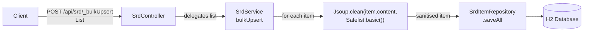

# ADR-002: HTML Content Sanitisation on Ingest

> **Status:** `Accepted`
> **Date:** 2026-05-13
> **Backlog item:** PBI-001
> **Decider:** Architecture Agent → 👤 Human approval required

---

## Context

`SrdItem.content` is a CLOB field that stores HTML-formatted SRD text. Content arrives via the `POST /api/srd/_bulkUpsert` endpoint and is sourced from a markdown-to-HTML conversion pipeline. If that pipeline (or a caller with admin credentials) injects a `<script>` tag or other executable HTML, it will be stored verbatim, served to any frontend consumer, and executed in the user's browser.

The acceptance scenarios require that:
1. A `<script>` tag submitted via bulk upsert is **not stored** in the database
2. Safe text surrounding the script tag is preserved
3. The frontend item detail page does not execute injected scripts

Sanitisation must happen at ingest time (before the entity is persisted), not at render time. Sanitising at the point of storage is the correct place because it provides a single, auditable enforcement point regardless of how many frontend clients consume the API.

---

## Decision Drivers

- **Primary:** XSS prevention — no executable content must survive persistence
- **Primary:** Content fidelity — safe HTML markup (paragraphs, bold, lists, links) must be preserved
- **Secondary:** Use a maintained, audited library rather than custom string manipulation
- **Constraint:** Must be enforced before persistence, not at render time
- **Constraint:** Must not require a frontend change to be effective (defence must be in the backend)

---

## Options Considered

### Option A: Jsoup `Cleaner` with an allowlist policy

[Jsoup](https://jsoup.org/) is a widely-used Java HTML parser. Its `Jsoup.clean(html, Safelist)` method parses the input, strips any element or attribute not on the allowlist, and returns clean HTML. A `Safelist.basic()` policy permits safe inline formatting (bold, italic, links, lists) while blocking all script, style, and event-handler attributes.

**Pros:**
- Simple API: one method call, one policy constant
- Actively maintained; used by millions of Java projects
- Allowlist approach (deny by default) is the correct security posture for sanitisation
- Preserves readable text and safe markup

**Cons:**
- Adds a direct dependency (`org.jsoup:jsoup`)
- The allowlist must be consciously extended if the SRD content legitimately uses HTML elements not in `Safelist.basic()` (e.g., tables, code blocks)

**Security implications:**
- Allowlist approach: anything not explicitly permitted is stripped. Safer than blocklist (which can be bypassed with encoding tricks).
- Jsoup's parser handles malformed HTML, so partial or obfuscated tags are not a bypass vector.

---

### Option B: OWASP Java HTML Sanitizer

The [OWASP Java HTML Sanitizer](https://owasp.org/www-project-java-html-sanitizer/) is a purpose-built security library with a policy-builder API. More configurable than Jsoup for fine-grained element/attribute control.

**Pros:**
- Purpose-built for security; comes with a strong pedigree
- Highly configurable policy builder

**Cons:**
- More complex API than Jsoup for this use case — `PolicyFactory` + `HtmlSanitizer.sanitize()` vs one method call
- Less widely used in the Spring ecosystem; smaller community; last release activity less frequent than Jsoup
- The additional configurability is not needed here — the SRD content has simple, well-known structure

**Security implications:**
- Equivalent security posture to Jsoup for this use case; the extra configurability provides no benefit here

---

### Option C: Strip tags with `String.replaceAll` / regex

Remove `<script>` and similar tags using regular expressions.

**Pros:**
- No new dependency

**Cons:**
- Regex-based HTML parsing is well-documented as fragile and bypassable (e.g., `<scr<script>ipt>`, Unicode encoding, case variants, attribute injection)
- Does not preserve safe markup — a strip-all approach destroys legitimate HTML formatting
- Violates the principle of using audited libraries for security-critical operations

**Security implications:**
- Unacceptable. Regex tag stripping has a long history of XSS bypass vectors.

---

## Decision

**We will use Option A: Jsoup `Cleaner` with `Safelist.basic()`.**

Jsoup's allowlist approach provides the correct security posture (deny by default) with the simplest possible API. The OWASP sanitizer (Option B) would be equally secure but adds complexity with no benefit for this use case. Regex stripping (Option C) is rejected outright as a known-bad approach.

The initial policy will be `Safelist.basic()`. If the SRD content requires additional elements (e.g., `<table>`, `<code>`), the policy is extended via `Safelist.basic().addTags(...)` — a one-line change that remains auditable.

---

## Architecture / Flow Diagram

Sanitisation is applied in the service layer, immediately before the entity is passed to the repository. Controllers do not sanitise; repositories do not sanitise. The service is the single enforcement point.

**Location in code:** A private `sanitise(SrdItem item)` method in `SrdService` mutates the `content` field before the item reaches the repository. This keeps the sanitisation logic co-located with the persistence call and ensures it cannot be bypassed by any future caller of the service.

---

## Consequences

### What becomes easier
- XSS via stored content is structurally prevented at the persistence layer
- Frontend components can use `dangerouslySetInnerHTML` (or equivalent) safely, because they can trust that stored content has been sanitised

### What becomes harder or riskier
- If the SRD pipeline generates HTML elements not in `Safelist.basic()` (e.g., tables), those elements will be silently stripped. The SRD content must be audited against the allowlist before the bulk import is run in production.
- The sanitisation is lossy — once content is stored, the original unsanitised form is gone. This is intentional but must be understood.

### Impact on existing system
- **Does this change any existing API contracts?** Behaviorally yes for the `_bulkUpsert` endpoint: content with unsafe HTML will now be silently sanitised before storage. No change to request/response shapes or HTTP status codes.
- **Does this require a database migration?** No — existing stored content is not retroactively sanitised by this change. A one-off migration script may be needed if production data is suspected to contain unsafe HTML, but this is out of scope for PBI-001.
- **Does this change authentication or authorisation behaviour?** No
- **Does this introduce new external dependencies?** Yes — `org.jsoup:jsoup`

---

## Security Considerations

- **Authentication:** The sanitisation endpoint (`_bulkUpsert`) is protected by ADR-001. Only authenticated admin callers can submit content. Sanitisation provides defence-in-depth even for authenticated callers.
- **Authorisation:** N/A — the sanitisation logic is not an authorisation decision.
- **Data sensitivity:** SRD content is public reference material; no PII involved.
- **Attack surface:** The `content` field is the trust boundary. Data enters from an authenticated caller whose input is still treated as untrusted (defence-in-depth). Sanitisation happens before persistence.
- **Threat mitigations:** Allowlist-based sanitisation blocks script injection, event-handler attributes, `javascript:` URLs, and style-based attacks. Jsoup's HTML parser handles malformed/obfuscated input.

---

## Acceptance Scenarios Affected

- `PBI-001-security-baseline.feature` — Scenario: "HTML content containing a script tag is sanitised before being stored"
- `PBI-001-security-baseline.feature` — Scenario: "Item detail page does not execute script tags from content"

---

## 👤 Human Review Checklist

- [X] The problem description matches my understanding of the intent
- [X] At least two options were genuinely considered (not a rubber stamp)
- [X] The chosen option's trade-offs are acceptable
- [X] The flow diagram / sequence makes sense end-to-end
- [X] The security section addresses auth, authorisation, and data sensitivity
- [X] No existing API contracts are broken without explicit acknowledgment
- [X] I am comfortable with this decision proceeding to implementation

**Decision:** `Approved`

---

## Notes

- Related ADRs: [ADR-001](./ADR-001-spring-security-admin-protection.md) (also PBI-001)
- References: [Jsoup Safelist API](https://jsoup.org/apidocs/org/jsoup/safety/Safelist.html), [OWASP XSS Prevention Cheat Sheet](https://cheatsheetseries.owasp.org/cheatsheets/Cross_Site_Scripting_Prevention_Cheat_Sheet.html)
