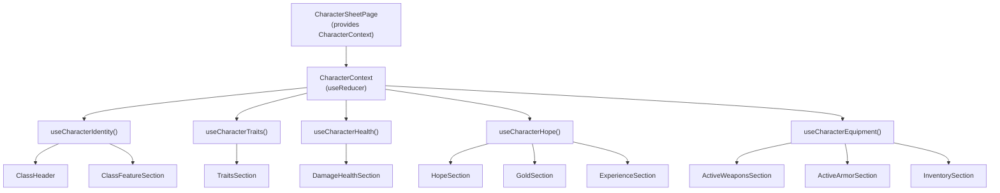

# ADR-012: Character Sheet Feature State Management

> **Status:** `Accepted`
> **Date:** 2026-05-14
> **Approved:** 2026-05-14 by product owner
> **Backlog item:** PBI-008, PBI-009, PBI-010, PBI-011, PBI-012
> **Decider:** Architecture Agent → ✅ Human approved

---

## Context

The character sheet feature (PBI-008–012) introduces a single page with approximately 50 discrete state fields spanning six sub-sections: identity, traits/defence, health trackers, hope/gold, active weapons, and inventory. These fields must be shared across many sibling components within the feature (e.g. the ClassHeader needs `classSlug` to know which class feature text to render; the HopeSection needs `classSlug` to display the correct Hope feature; the SubclassDropdown depends on `classSlug` to filter its options).

No state management pattern for feature-level client state currently exists in the codebase. The existing patterns are:

- **ADR-010** — server state (SRD data) fetched via typed service functions and custom hooks (`useSrdSearch`, `useSrdTypes`)
- **Coding guidelines** — "Prefer local state (`useState`, `useReducer`) and server state (React Query / SWR) over global state. Global state is only introduced when state genuinely needs to be shared across unrelated parts of the UI."

Character state is **client state** (no persistence in this iteration). It does not belong in React Query. It is shared across related parts of a single feature, so full global state (Zustand, Redux) is disproportionate. A scoped solution is required.

---

## Decision Drivers

- **Primary:** The 50+ state fields must be accessible by sibling components without illegal prop-drilling through a deep tree
- **Primary:** Must follow the architecture guideline — components render; hooks manage logic and state
- **Primary:** Must not introduce a new runtime dependency unless necessary (per the precedent set in ADR-010)
- **Secondary:** The state shape must be easy to extend when persistence is added (future increment)
- **Constraints:** No global state library (Zustand, Redux) unless state genuinely crosses feature boundaries — it does not here

---

## Options Considered

### Option A: Prop-drilling from CharacterSheetPage

All state lives in `CharacterSheetPage` via `useState` calls. Each sub-component receives the specific slices it needs as props, plus setter callbacks.

**Pros:**
- Simplest possible approach; no new patterns
- Full TypeScript type visibility at the call site

**Cons:**
- ~50 fields × 2 (value + setter) = ~100 props propagating through the tree
- Every intermediate component must pass props it doesn't use ("prop-drilling")
- Adding a new field in PBI-009 requires threading it through every intermediate layer
- Violates the spirit of the feature-first guideline by making the page component a God object

**Security implications:**
- None specific

---

### Option B: React Context + useReducer scoped to the character-sheet feature

Introduce a `CharacterContext` that holds all character state as a single `CharacterState` object, managed by a `useReducer`. The context is provided at the `CharacterSheetPage` level and is therefore scoped to the character sheet feature — it does not pollute the global React tree.

Each section accesses only the slice it needs via a dedicated custom hook (e.g. `useCharacterIdentity()`, `useCharacterTraits()`), keeping components decoupled from the full state shape.

**Pros:**
- No prop-drilling — any component within the character sheet can subscribe to context
- `useReducer` action dispatch pattern makes state transitions explicit and traceable
- The `CharacterState` type is a single source of truth for the full character data shape — easy to serialise for future persistence
- Scoped to the feature — no global state pollution
- No new runtime dependency
- Follows the feature-first structure: `features/character-sheet/context/CharacterContext.tsx`

**Cons:**
- New pattern for this codebase — requires clear documentation
- All components under `CharacterSheetPage` re-render on any state change unless React.memo is used (acceptable for this feature size; can be optimised later)
- Context adds a small amount of boilerplate (provider, reducer, action types)

**Security implications:**
- Character state is client-only and contains no sensitive data (no credentials, no PII beyond a player-chosen character name/pronouns)
- The context is never serialised or sent to the backend in this iteration

---

### Option C: Zustand store

Introduce Zustand as a new runtime dependency. Define a character store with slices for each section.

**Pros:**
- Excellent DX; minimal boilerplate compared to Context + useReducer
- Built-in selector support prevents unnecessary re-renders

**Cons:**
- New runtime dependency — requires ADR justification (coding guidelines: "Global state is only introduced when state genuinely needs to be shared across unrelated parts of the UI")
- Character state is NOT shared across unrelated parts — it lives entirely within the character sheet feature. Zustand's global store would be disproportionate.
- Adds a dependency that future increments may or may not need

**Security implications:**
- Zustand stores are in-memory by default; no security concern for this use case

---

## Decision

**We will use Option B: React Context + useReducer scoped to the character-sheet feature.**

Option A fails at scale for this feature's state complexity. Option C is the right tool for genuinely global state but would violate the architecture guideline that global state be reserved for cross-feature sharing — character state is entirely self-contained. Option B achieves full decoupling within the feature, introduces no new dependency, and produces a `CharacterState` type that is trivially serialisable for when persistence is added in a future PBI.

---

## Architecture / Flow Diagram

```
src/features/character-sheet/
├── context/
│   └── CharacterContext.tsx        ← Context definition, Provider, reducer, initial state
├── hooks/
│   ├── useCharacterIdentity.ts     ← { name, pronouns, classSlug, heritageSlug,
│   │                                    subclassSlug, level, dispatch }
│   ├── useCharacterTraits.ts       ← { traits, evasion, armorScore, armorSlots, dispatch }
│   ├── useCharacterHealth.ts       ← { damageThresholds, hpSlots, stressSlots, dispatch }
│   ├── useCharacterHope.ts         ← { hopeDiamonds, proficiencyPips, experience,
│   │                                    gold, dispatch }
│   └── useCharacterEquipment.ts    ← { primaryWeapon, secondaryWeapon, activeArmor,
│                                        inventory, inventoryWeapons, dispatch }
├── components/
│   ├── CharacterSheetPage.tsx      ← Provides CharacterContext; renders layout
│   ├── ClassHeader.tsx             ← useCharacterIdentity() + useSrdClasses()
│   ├── TraitsSection.tsx           ← useCharacterTraits()
│   ├── DamageHealthSection.tsx     ← useCharacterHealth()
│   ├── HopeSection.tsx             ← useCharacterHope() + useCharacterIdentity()
│   ├── ExperienceSection.tsx       ← useCharacterHope()
│   ├── GoldSection.tsx             ← useCharacterHope()
│   ├── ClassFeatureSection.tsx     ← useCharacterIdentity() + useSrdClasses()
│   ├── ActiveWeaponsSection.tsx    ← useCharacterEquipment() + useCharacterHope()
│   ├── ActiveArmorSection.tsx      ← useCharacterEquipment()
│   └── InventorySection.tsx        ← useCharacterEquipment()
└── index.ts                        ← exports CharacterSheetPage
```



### CharacterState type contract

```typescript
interface CharacterState {
  // Identity (PBI-009)
  name: string;
  pronouns: string;
  classSlug: string | null;
  heritageSlug: string | null;
  subclassSlug: string | null;
  level: number | null;

  // Traits & Defence (PBI-010)
  traits: Record<'agility' | 'strength' | 'finesse' | 'instinct' | 'presence' | 'knowledge', number | null>;
  evasion: number;          // default 10
  armorScore: number | null;
  armorSlots: boolean[];    // length 6

  // Health (PBI-011)
  damageThresholds: { minor: number | null; major: number | null; severe: number | null };
  hpSlots: boolean[];       // length 10 (6 solid + 4 dashed)
  stressSlots: boolean[];   // length 8 (4 solid + 4 dashed)

  // Hope & Gold (PBI-011)
  hopeDiamonds: boolean[];     // length 6
  proficiencyPips: boolean[];  // length 6, [0] = true by default
  experience: string[];        // length 5
  gold: { handfuls: number; bags: number; chest: number };

  // Equipment (PBI-012)
  primaryWeapon: WeaponEntry | null;
  secondaryWeapon: WeaponEntry | null;
  activeArmor: ArmorEntry | null;
  inventory: string[];         // length 6
  inventoryWeapons: [InventoryWeaponEntry, InventoryWeaponEntry];
}

type CharacterAction =
  | { type: 'SET_IDENTITY'; payload: Partial<Pick<CharacterState, 'name' | 'pronouns' | 'classSlug' | 'heritageSlug' | 'subclassSlug' | 'level'>> }
  | { type: 'SET_TRAIT'; payload: { trait: keyof CharacterState['traits']; value: number | null } }
  | { type: 'SET_EVASION'; payload: number }
  | { type: 'SET_ARMOR_SCORE'; payload: number | null }
  | { type: 'TOGGLE_ARMOR_SLOT'; payload: number }
  | { type: 'SET_DAMAGE_THRESHOLD'; payload: { key: 'minor' | 'major' | 'severe'; value: number | null } }
  | { type: 'TOGGLE_HP_SLOT'; payload: number }
  | { type: 'TOGGLE_STRESS_SLOT'; payload: number }
  | { type: 'TOGGLE_HOPE_DIAMOND'; payload: number }
  | { type: 'TOGGLE_PROFICIENCY_PIP'; payload: number }
  | { type: 'SET_EXPERIENCE'; payload: { index: number; value: string } }
  | { type: 'SET_GOLD'; payload: Partial<CharacterState['gold']> }
  | { type: 'SET_PRIMARY_WEAPON'; payload: WeaponEntry | null }
  | { type: 'SET_SECONDARY_WEAPON'; payload: WeaponEntry | null }
  | { type: 'SET_ACTIVE_ARMOR'; payload: ArmorEntry | null }
  | { type: 'SET_INVENTORY_LINE'; payload: { index: number; value: string } }
  | { type: 'SET_INVENTORY_WEAPON'; payload: { index: 0 | 1; value: InventoryWeaponEntry } };
```

---

## Consequences

### What becomes easier
- Each section component is self-contained — it accesses only its slice via a focused hook
- The `CharacterState` type is the canonical representation of a character — trivially serialisable to JSON for future persistence
- Adding new fields requires only: adding to `CharacterState`, adding an action to `CharacterAction`, updating the reducer, and updating the relevant hook

### What becomes harder or riskier
- All components under `CharacterSheetPage` share the same render cycle — a toggle in the Gold section triggers a re-render of the Traits section. This is acceptable for this feature size. If profiling reveals issues, targeted `React.memo` wrapping is the mitigation.
- The Context + useReducer pattern is new to this codebase — implementors must follow it consistently

### Impact on existing system
- **API contracts:** No — this is client state only
- **Database migration:** No
- **Auth/authorisation behaviour:** No
- **New external dependencies:** No

---

## Security Considerations

- **Authentication:** The character sheet route is public (no login required), consistent with the rest of the app
- **Authorisation:** No authorisation required — character state is local to the browser session
- **Data sensitivity:** Character data (name, pronouns, class choices) is low sensitivity. It is never sent to the backend in this iteration. Pronouns are the most personally sensitive field — they are stored only in-memory, never persisted or logged.
- **Attack surface:** No new endpoints. No user data leaves the browser.
- **Threat mitigations:** SRD content displayed in the Class Feature section is HTML from the backend. It must be rendered via the existing `dangerouslySetInnerHTML` pattern that is already gated behind ADR-002's Jsoup sanitisation. No new XSS surface is introduced beyond what already exists in the item detail view.

---

## Acceptance Scenarios Affected

- `PBI-008-character-sheet-foundation.feature` — all layout scenarios
- `PBI-009-character-sheet-class-identity.feature` — all class/identity scenarios
- `PBI-010-character-sheet-traits-defence.feature` — all trait/toggle scenarios
- `PBI-011-character-sheet-health-hope-gold.feature` — all tracker scenarios
- `PBI-012-character-sheet-weapons-armor.feature` — all equipment scenarios

---

## 👤 Human Review Checklist

- [x] The problem description matches my understanding of the intent
- [x] At least two options were genuinely considered (not a rubber stamp)
- [x] The chosen option's trade-offs are acceptable
- [x] The flow diagram / sequence makes sense end-to-end
- [x] The security section addresses auth, authorisation, and data sensitivity
- [x] No existing API contracts are broken without explicit acknowledgment
- [x] I am comfortable with this decision proceeding to implementation

**Decision:** `Approved — 2026-05-14 by product owner`

---

## Notes

- Related ADRs: [ADR-010](./ADR-010-api-service-layer-and-hooks.md) (service + hook pattern for SRD data), [ADR-011](./ADR-011-react-router-url-navigation.md) (routing)
- When persistence is added (future increment), the `CharacterState` object is serialised to JSON and either stored in `localStorage` (short-term) or POSTed to a new backend endpoint (long-term). The Context shape is designed to support both without restructuring.
