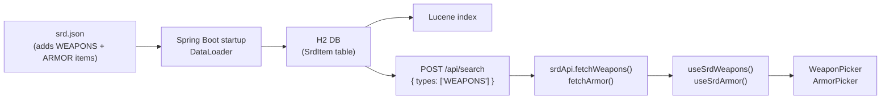

# ADR-013: Weapon and Armor SRD Data — Structured Item Types

> **Status:** `Accepted`
> **Date:** 2026-05-14
> **Approved:** 2026-05-14 by product owner
> **Backlog item:** PBI-012
> **Decider:** Architecture Agent → ✅ Human approved

---

## Context

The character sheet's weapon and armor pickers (PBI-012) need a list of available weapons and armor from the SRD. Currently the SRD data in `backend/src/main/resources/srd.json` contains weapon and armor data only as **HTML table content embedded inside CONTENTS type entries** (e.g. "Primary Weapon Tables", "Secondary Weapon Tables"). There are no `WEAPONS` or `ARMOR` item types in the SRD.

The frontend cannot reliably query the existing data for dropdown population because:
1. The data is embedded in HTML prose, requiring fragile HTML parsing on the client
2. The existing `POST /api/search` endpoint filters by `type` — there is no `type=WEAPONS` to query
3. Individual weapon slugs (e.g. `shortsword`) appear as links inside the HTML but are not their own queryable SRD items

A decision is required on how to make weapon and armor data queryable in a structured, maintainable form.

---

## Decision Drivers

- **Primary:** The frontend weapon/armor pickers must be backed by queryable SRD data, not HTML parsing
- **Primary:** Must not introduce a new backend endpoint or schema change beyond what the existing SrdItem model already supports
- **Primary:** Must be consistent with how all other SRD data is stored and served
- **Secondary:** Must be maintainable — adding a new weapon in a future release should not require frontend code changes
- **Constraints:** The existing `POST /api/search` endpoint and `SrdItem` model are the approved data access pattern; the existing `POST /api/srd/_bulkUpsert` admin endpoint is available for data migration

---

## Options Considered

### Option A: Client-side HTML parsing of existing CONTENTS entries

Fetch the "Primary Weapon Tables" and "Secondary Weapon Tables" CONTENTS items from the backend and parse the HTML `<table>` elements in the frontend service layer to extract weapon rows.

**Pros:**
- No backend change required
- No data migration step

**Cons:**
- Extremely fragile — any formatting change to the HTML content breaks the parser
- HTML parsing logic in a TypeScript service layer violates the principle of explicit, traceable behaviour
- Produces untyped, unpredictable results if the HTML structure varies between entries
- Armour data access pattern is similarly fragile (armour tables are also in CONTENTS)

**Security implications:**
- Parsing HTML from the backend introduces a potential injection surface if the HTML parsing is not strictly bounded. Risk is low (data comes from our own backend, already sanitised via ADR-002), but the pattern is not recommended.

---

### Option B: Static TypeScript constants in the frontend

Extract weapon and armor data from the SRD JSON at development time and encode it as TypeScript constant arrays in `src/features/character-sheet/data/weapons.ts` and `armor.ts`.

**Pros:**
- No backend change required
- Zero network requests for weapon/armor lists — data is bundled
- Fully typed at compile time

**Cons:**
- Duplicates SRD data — any future SRD update requires a manual frontend code change
- Breaks the principle that SRD data is served from the backend (the existing compendium already serves all other SRD content via API)
- Not queryable via the backend search, which means these items will not appear in compendium search results either

**Security implications:**
- No concerns — static read-only data

---

### Option C: Add WEAPONS and ARMOR item types to srd.json

Extract weapon and armor data from the existing CONTENTS entries in `srd.json` and add them as new structured `SrdItem` entries with `type: "WEAPONS"` and `type: "ARMOR"`. No schema change is required — the `SrdItem` model already supports arbitrary types. The existing `POST /api/search` endpoint will then support `{ types: ["WEAPONS"] }` queries.

**Pros:**
- Fully consistent with the existing SRD data pattern — same model, same endpoint, same query mechanism
- Weapons and armor become queryable by the compendium search (a future benefit)
- Adding new weapons in future only requires a data update (re-running the extraction), not a code change
- The frontend service layer remains clean — calls `searchItems({ types: ['WEAPONS'] })` exactly as it does for classes or communities

**Cons:**
- Requires a one-time data extraction step: the implementation agent parses the existing HTML table CONTENTS entries and writes structured `SrdItem` entries into `srd.json`
- Slightly increases the size of `srd.json`

**Security implications:**
- No new endpoints. The `_bulkUpsert` admin endpoint (protected by HTTP Basic auth per ADR-001) is not involved — the items are added directly to `srd.json` as source data, not injected at runtime.

---

## Decision

**We will use Option C: Add WEAPONS and ARMOR item types to srd.json.**

Option A is too fragile for a production feature. Option B violates the architectural principle that SRD content is backend-owned. Option C is entirely consistent with the existing data model and access pattern — the frontend makes one additional `POST /api/search` call with `{ types: ['WEAPONS'] }`, which is identical to the call already made for `CLASSES` or `COMMUNITIES`.

Each weapon/armor item uses:
- `type`: `"WEAPONS"` or `"ARMOR"`
- `title`: weapon/armor name (e.g. `"Rapier"`, `"Gambeson Armor"`)
- `slug`: kebab-cased name (e.g. `"rapier"`, `"gambeson-armor"`)
- `content`: HTML markup with structured fields (see Implementation Note below)
- `tags`: empty array (tier and category are encoded in `content` HTML text)
- `excerpt`: one-line summary

The frontend `WeaponEntry` and `ArmorEntry` types parse the `content` field. For Tier 1 MVP all Tier 1 primary weapons, all Tier 1 secondary weapons, and all Tier 1 armor items are included.

**Implementation Note (amendment approved 2026-05-14):** The original ADR specified `content` as a JSON string parsed with `JSON.parse`. During implementation it was discovered that WEAPONS and ARMOR items already existed in `srd.json` (192 weapons, 34 armor) with HTML content in a consistent, parseable format:

```html
<!-- Weapon -->
<p><strong>Trait:</strong> Agility; <strong>Range:</strong> Melee; <strong>Damage:</strong> d8 phy; <strong>Burden:</strong> One-Handed</p>
<p><strong>Feature:</strong> <strong><em>Reliable:</em></strong> +1 to attack rolls</p>
<p><em>Primary Weapon - Tier 1</em></p>

<!-- Armor -->
<p><strong>Base Thresholds:</strong> 5 / 11; <strong>Base Score:</strong> 3</p>
<p><strong>Feature:</strong> <strong><em>Flexible:</em></strong> +1 to Evasion</p>
<p><em>Armor - Tier 1</em></p>
```

The frontend hooks (`useSrdWeapons`, `useSrdArmor`) extract fields via regex from the HTML content. Tier and category (primary/secondary) are derived from the `<em>` line. This approach was preferred over converting all existing entries to JSON strings. All parsing is wrapped in try/catch — malformed entries degrade gracefully to empty fields. **Approved by product owner 2026-05-14.**

---

## Architecture / Flow Diagram



### New SrdItem entries — WEAPONS example

```json
{
  "type": "WEAPONS",
  "title": "Rapier",
  "slug": "rapier",
  "excerpt": "Presence - Melee - d8 phy - One-Handed",
  "content": "{\"trait\":\"Presence\",\"range\":\"Melee\",\"damage\":\"d8 phy\",\"burden\":\"One-Handed\",\"feature\":\"Quick: When you make an attack, you can mark a Stress to target another creature within range.\"}",
  "tags": ["tier:1", "primary"],
  "sourceRef": "contents/Primary Weapon Tables.md"
}
```

### New SrdItem entries — ARMOR example

```json
{
  "type": "ARMOR",
  "title": "Gambeson Armor",
  "slug": "gambeson-armor",
  "excerpt": "Thresholds 5/11 - Score 3 - Flexible",
  "content": "{\"thresholds\":\"5/11\",\"score\":3,\"feature\":\"Flexible: +1 to Evasion\"}",
  "tags": ["tier:1"],
  "sourceRef": "contents/Armor Tables.md"
}
```

### New service functions (extending srdApi.ts per ADR-010)

```typescript
export async function fetchWeapons(serverUrl: string, tier?: number): Promise<WeaponEntry[]>
export async function fetchArmor(serverUrl: string): Promise<ArmorEntry[]>
```

### New types (src/features/character-sheet/types/equipment.ts)

```typescript
interface WeaponEntry {
  slug: string;
  name: string;
  trait: string;
  range: string;
  damage: string;
  burden: string;
  feature: string;
  tier: number;
  category: 'primary' | 'secondary';
}

interface ArmorEntry {
  slug: string;
  name: string;
  thresholds: string;
  score: number;
  feature: string;
}

interface InventoryWeaponEntry {
  name: string;
  traitAndRange: string;
  damageType: string;
  feature: string;
  role: 'primary' | 'secondary';
}
```

---

## Consequences

### What becomes easier
- Weapon and armor data is queryable via the existing search API — they will appear in compendium search results
- New SRD content updates only require a `srd.json` update, not frontend code changes
- The frontend weapon/armor service functions follow the exact same pattern as `fetchTypes` and `searchItems`

### What becomes harder or riskier
- The `content` field on WEAPONS/ARMOR items is a JSON string (rather than HTML prose) — this is a new convention for the SRD. Future items must follow this pattern. The implementation agent must document this in the `srd.json` header comment.

### Impact on existing system
- **API contracts:** No change — `POST /api/search` already supports arbitrary `types` values
- **Database migration:** No — `srd.json` is the source; the H2 DB is populated on startup
- **Auth/authorisation behaviour:** No
- **New external dependencies:** No

---

## Security Considerations

- **Authentication:** The search endpoint is public; no change to auth behaviour
- **Authorisation:** No change
- **Data sensitivity:** Weapon/armor data is public SRD content; no sensitive data
- **Attack surface:** No new endpoints. The `_bulkUpsert` admin endpoint is not used in production (data is in `srd.json`)
- **Threat mitigations:** The `content` field on WEAPONS/ARMOR items is a JSON string parsed by the frontend. The frontend must parse it with `JSON.parse` inside a try/catch — malformed content should degrade gracefully (fall back to empty fields), not throw an unhandled exception

---

## Acceptance Scenarios Affected

- `PBI-012-character-sheet-weapons-armor.feature` — all weapon/armor picker scenarios

---

## 👤 Human Review Checklist

- [x] The problem description matches my understanding of the intent
- [x] At least two options were genuinely considered (not a rubber stamp)
- [x] The chosen option's trade-offs are acceptable
- [x] The flow diagram / sequence makes sense end-to-end
- [x] The security section addresses auth, authorisation, and data sensitivity
- [x] No existing API contracts are broken without explicit acknowledgment
- [x] I am comfortable with this decision proceeding to implementation

**Decision:** `Approved — 2026-05-14 by product owner (including the HTML-parsing amendment documented in the Decision section above)`

---

## Notes

- Related ADRs: [ADR-010](./ADR-010-api-service-layer-and-hooks.md) (service + hook pattern), [ADR-002](./ADR-002-html-content-sanitisation.md) (SRD content sanitisation)
- The extraction of weapon/armor data from existing CONTENTS HTML tables is an implementation task for PBI-012. The implementation agent must handle the case where a weapon's feature is a long HTML string — strip HTML tags and store as plain text in the `content` JSON.
- Tier scoping for MVP: all Tier 1 primary weapons, all Tier 1 secondary weapons, all Tier 1 armor. Higher tiers are added in a future data update.
