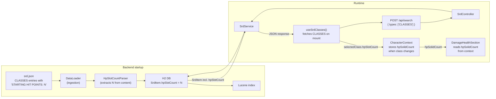

# ADR-014: Surfacing per-class HP slot count from the backend

> **Status:** `Proposed`
> **Date:** 2026-05-14
> **Backlog item:** PBI-017
> **Decider:** Architecture Agent → 👤 Human approval required

---

## Context

PBI-017 requires the character sheet to render the correct number of solid-bordered HP boxes for the selected class. Currently `DamageHealthSection.tsx` uses a hardcoded constant (`HP_SOLID_COUNT = 6`). The actual per-class starting HP values differ across the nine classes (range: 5–7) and are the authoritative source for how many solid vs dashed HP boxes a player's sheet should show.

The per-class HP count is already embedded in the HTML content of each CLASSES `SrdItem` in `srd.json` — specifically the line `STARTING HIT POINTS: N` inside each class's content block. The frontend must not parse this itself (the product requirement states business logic of this kind belongs in the backend).

A decision is needed for how the backend surfaces this numeric value to the frontend, given that `SrdItem` currently has no dedicated field for it.

---

## Decision Drivers

- **Primary:** Business logic (extracting game stats from SRD content) must not live in the frontend
- **Primary:** Consistency with existing SrdItem data access pattern — the frontend already has the selected class's `SrdItem` in memory; no additional API call should be needed
- **Primary:** The value must be type-safe and unambiguous in the API response
- **Secondary:** Minimal schema disruption; the existing optional numeric fields (`level`, `recallCost`) provide an established pattern
- **Constraints:** `SrdItem` is a shared entity used by all SRD types; any new field must be nullable so it doesn't break non-CLASSES items

---

## Options Considered

### Option A: Parse content at request time in the service layer; return as an enriched field

When the frontend requests CLASSES items via `POST /api/search`, the `SrdService` parses `STARTING HIT POINTS: N` from the content string before returning results. The parsed value is projected onto the existing `hpSlotCount` field (or returned via a DTO wrapper). The raw entity is not changed.

**Pros:**
- No database schema change
- No ingestion code change
- Data remains in one canonical location (the content HTML)

**Cons:**
- Parsing runs on every API request rather than once at ingest time — minor but unnecessary runtime overhead
- The value is not independently testable at persistence level; a malformed content string would silently return null/0 to the frontend
- Requires either a DTO wrapper (new pattern) or shoe-horning the value into an existing field (misleading semantics)

**Security implications:**
- The content field is already sanitised at ingest (ADR-002); no new trust boundary

---

### Option B: Parse content at ingestion time; store in a new `hpSlotCount` nullable field on `SrdItem`

Add `Integer hpSlotCount` to the `SrdItem` JPA entity. During data loading (`DataLoader` / ingestion service), parse `STARTING HIT POINTS: N` from the content of each CLASSES item and store it in the field. All other item types leave the field null.

The existing `POST /api/search` response already serialises all `SrdItem` fields, so `hpSlotCount` is included automatically in the response for CLASSES items. No new endpoint or response shape is needed.

The frontend `SrdItem` TypeScript type gains an optional `hpSlotCount?: number` field. The frontend reads it from the already-fetched class object — no additional API call.

**Pros:**
- Parsing happens once at startup, not on every request
- The value is stored, independently queryable, and testable at the repository level
- Consistent with the existing optional numeric field pattern (`level`, `recallCost`, `subtype`)
- No new endpoint or DTO — `hpSlotCount` surfaces naturally through the existing `POST /api/search` response
- Frontend receives a clean typed field, not a tag string to parse

**Cons:**
- Adds one nullable column to the `SrdItem` table — only populated for CLASSES rows
- H2 schema auto-updates on startup (no manual migration needed for development); a production deployment would need a schema migration script

**Security implications:**
- No new endpoint or trust boundary
- The content regex is applied to backend-owned, already-sanitised data; no user input involved

---

### Option C: Add `hp-slots:N` tags to CLASSES entries in srd.json

Manually edit each CLASSES entry in `srd.json` to add a tag like `"hp-slots:5"`. The frontend (or backend) extracts the numeric value from the tag string.

**Pros:**
- No schema change to the entity
- No ingestion parsing code required

**Cons:**
- Duplicates data that already exists canonically in the content — two sources of truth for the same value
- If the tag is parsed on the frontend it violates the "no business logic in frontend" requirement; if parsed in the backend it requires the same ingestion-time extraction as Option B but without the clean typed field
- Tag strings are weakly typed; `"hp-slots:five"` would not be caught at compile time

**Security implications:**
- No concerns

---

## Decision

**We will use Option B: parse content at ingestion time and store in a new `hpSlotCount` nullable field on `SrdItem`.**

Option A's runtime parsing adds unnecessary overhead and is harder to test in isolation. Option C duplicates data and is weakly typed. Option B is consistent with the existing nullable numeric field pattern on `SrdItem`, surfaces the value through the already-established search API response with zero new endpoint surface, and keeps parsing in the backend exactly once — at startup when the `srd.json` data is loaded.

The one-column schema change is low risk: H2 auto-updates on startup; the field is nullable so all existing non-CLASSES items are unaffected; the API response for CLASSES gains a new optional field, which is a backward-compatible additive change.

---

## Architecture / Flow Diagram



### Backend changes

**`SrdItem.java`** — new nullable field:
```java
@Column(name = "hp_slot_count")
private Integer hpSlotCount;
```

**Ingestion service** — parse during data load:
```
Pattern: STARTING HIT POINTS:\s*(\d+)
Applied to: content of each CLASSES item
Stored in: SrdItem.hpSlotCount
Items where content does not match: hpSlotCount remains null
```

### API response change (additive, backward-compatible)

`POST /api/search` response for a CLASSES item gains one new field:
```json
{
  "type": "CLASSES",
  "slug": "bard",
  "title": "Bard",
  "hpSlotCount": 5,
  ...existing fields unchanged...
}
```

Non-CLASSES items: `hpSlotCount` is absent (null is omitted from JSON serialisation via `@JsonInclude(NON_NULL)`).

### Frontend changes

**`SrdItem` TypeScript type** (`src/types/index.ts`):
```typescript
hpSlotCount?: number;
```

**`CharacterContext` / reducer** — when class changes, store `hpSlotCount`:
```
SET_IDENTITY action: if payload includes classSlug, also set hpSolidCount
  = selectedClass.hpSlotCount ?? 6  (fallback to 6 if null)
```

**`DamageHealthSection`** — replaces `HP_SOLID_COUNT = 6` constant with `hpSolidCount` from `useCharacterHealth()`.

---

## Consequences

### What becomes easier
- Per-class HP slot count is correctly driven by backend data for all 9 classes
- Future SRD updates (new classes, HP changes) only require a `srd.json` update and re-ingestion
- `hpSlotCount` is independently testable at the backend acceptance test level

### What becomes harder or riskier
- Production deployments need a one-column `ALTER TABLE` migration (low risk — nullable column with no default constraint)
- A regex parse failure during ingestion (malformed content) silently results in `null`; the frontend fallback of 6 would hide the problem. The ingestion service should log a warning for any CLASSES item where parsing returns null.

### Impact on existing system
- **API contracts:** Additive only — existing consumers receive one new nullable field on CLASSES items. No existing fields change.
- **Database migration:** One new nullable column `hp_slot_count` on `srd_item` table. H2 auto-updates in dev. Production requires `ALTER TABLE srd_item ADD COLUMN hp_slot_count INTEGER;`
- **Auth/authorisation behaviour:** No change
- **New external dependencies:** No

---

## Security Considerations

- **Authentication:** No change — `POST /api/search` is a public read endpoint
- **Authorisation:** No change
- **Data sensitivity:** `hpSlotCount` is public SRD game data; no sensitive data involved
- **Attack surface:** No new endpoints introduced
- **Threat mitigations:** The regex is applied only to backend-owned, Jsoup-sanitised content (ADR-002). No user input reaches the parser.

---

## Acceptance Scenarios Affected

- `PBI-017-class-hp-slot-count.feature` — all scenarios

---

## 👤 Human Review Checklist

- [ ] The problem description matches my understanding of the intent
- [ ] At least two options were genuinely considered (not a rubber stamp)
- [ ] The chosen option's trade-offs are acceptable
- [ ] The flow diagram / sequence makes sense end-to-end
- [ ] The security section addresses auth, authorisation, and data sensitivity
- [ ] No existing API contracts are broken without explicit acknowledgment
- [ ] I am comfortable with this decision proceeding to implementation

**Decision:** `Approved` / `Rejected — [reason]` / `Needs revision — [what to revisit]`

---

## Notes

- Related ADRs: [ADR-010](./ADR-010-api-service-layer-and-hooks.md) (service + hook pattern), [ADR-012](./ADR-012-character-sheet-state-management.md) (React Context + useReducer for character state), [ADR-013](./ADR-013-weapon-armor-srd-item-types.md) (precedent for content-parsing at ingestion vs frontend)
