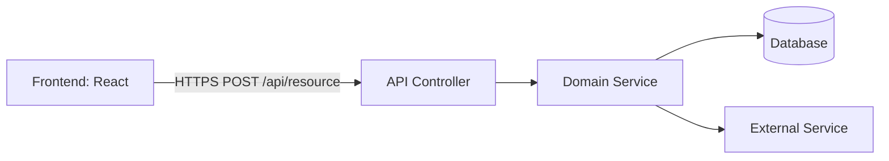

# ADR-XXX: [Decision Title]

> **Status:** `Proposed` | `Accepted` | `Superseded by ADR-YYY` | `Deprecated`
> **Date:** YYYY-MM-DD
> **Backlog item:** PBI-XXX
> **Decider:** Architecture Agent → 👤 Human approval required

---

## Context

_What is the situation that forces a decision? Describe the problem, the constraints, and any relevant background. Write this so a reader with no prior context can understand why this decision exists at all._

_Include:_
- _The specific backlog item or feature driving this decision_
- _Current state of the system (if this changes something that already exists)_
- _Constraints: technical, time, team, regulatory, or otherwise_
- _Any assumptions being made_

---

## Decision Drivers

_The criteria this decision is being evaluated against — in rough priority order._

- **Primary:** [e.g., security, consistency with existing patterns, user experience]
- **Secondary:** [e.g., implementation speed, maintainability]
- **Constraints:** [e.g., must work within existing auth system, must not break existing API consumers]

---

## Options Considered

_At least two options must be considered. Each option gets an honest assessment._

### Option A: [Name]

[Brief description of the approach.]

**Pros:**
- …

**Cons:**
- …

**Security implications:**
- …

---

### Option B: [Name]

[Brief description of the approach.]

**Pros:**
- …

**Cons:**
- …

**Security implications:**
- …

---

### Option C: [Name] _(if applicable)_

[Brief description of the approach.]

**Pros:**
- …

**Cons:**
- …

**Security implications:**
- …

---

## Decision

**We will use Option [A/B/C]: [Name].**

[One paragraph explaining why this option was chosen over the others, referencing the decision drivers. Be explicit about trade-offs being accepted.]

---

## Architecture / Flow Diagram

_A diagram or structured description of the component boundaries and data flow introduced or changed by this decision. This is the primary artefact for human review — it must be clear enough that the flow can be understood without reading code._

_Use a Mermaid diagram where possible:_

_Or describe the flow as a numbered sequence if a diagram is not appropriate:_

1. The frontend sends `POST /api/resource` with payload `{ … }`.
2. The controller validates the request using Bean Validation.
3. The domain service applies business rules and calls the repository.
4. The repository persists the entity and returns the saved state.
5. The controller maps the domain result to a response DTO and returns `201 Created`.

---

## Consequences

### What becomes easier
- …

### What becomes harder or riskier
- …

### Impact on existing system
- _Does this change any existing API contracts?_ Yes/No — [details]
- _Does this require a database migration?_ Yes/No — [details]
- _Does this change authentication or authorisation behaviour?_ Yes/No — [details]
- _Does this introduce new external dependencies?_ Yes/No — [details]

---

## Security Considerations

_This section is mandatory for every ADR, even if the answer is "no significant impact."_

- **Authentication:** [How does this interact with the auth system?]
- **Authorisation:** [Who can perform the actions this decision introduces? Where are permission checks enforced?]
- **Data sensitivity:** [Does this decision handle or expose sensitive data? How is it protected?]
- **Attack surface:** [Does this introduce new endpoints, integrations, or trust boundaries?]
- **Threat mitigations:** [What specific mitigations are in place?]

---

## Acceptance Scenarios Affected

_List the `.feature` files whose scenarios are directly influenced by this decision._

- `PBI-XXX-feature-name.feature` — Scenario: "[Scenario name]"

---

## 👤 Human Review Checklist

_The Architecture Agent completes the ADR above. The human reviews the following before approving:_

- [ ] The problem description matches my understanding of the intent
- [ ] At least two options were genuinely considered (not a rubber stamp)
- [ ] The chosen option's trade-offs are acceptable
- [ ] The flow diagram / sequence makes sense end-to-end
- [ ] The security section addresses auth, authorisation, and data sensitivity
- [ ] No existing API contracts are broken without explicit acknowledgment
- [ ] I am comfortable with this decision proceeding to implementation

**Decision:** `Approved` / `Rejected — [reason]` / `Needs revision — [what to revisit]`

---

## Notes

_Any additional context, links to related ADRs, or references._

- Related ADRs: [ADR-XXX](./ADR-XXX-title.md)
- References: [link to relevant documentation, RFC, or prior art]
