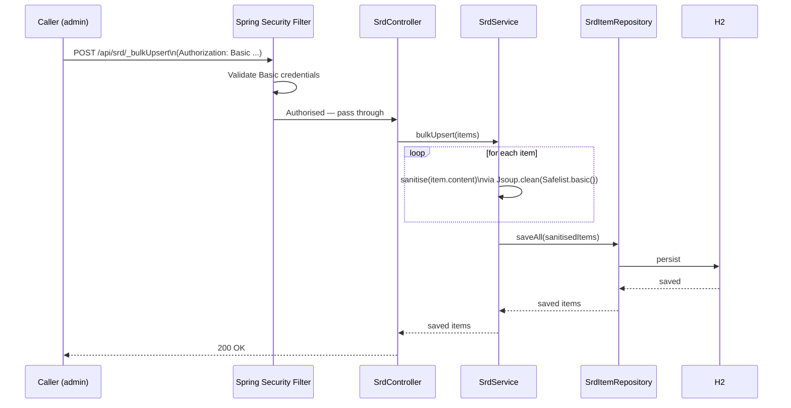
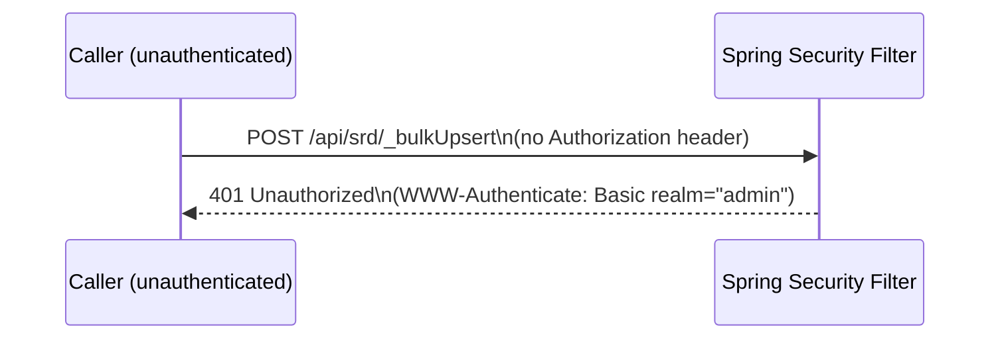
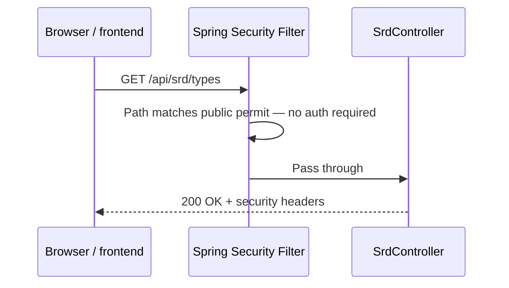

# Flow Descriptor: PBI-001 — Security Baseline

> **Status:** Proposed
> **Date:** 2026-05-13
> **Backlog item:** PBI-001
> **ADRs:** [ADR-001](./ADR-001-spring-security-admin-protection.md), [ADR-002](./ADR-002-html-content-sanitisation.md)

---

## 1. What This Builds

PBI-001 hardens the backend against two classes of vulnerability without changing any user-visible behaviour:

1. **Unauthenticated access to admin endpoints** — `POST /api/srd/_bulkUpsert` and `GET /api/srd/_reindex` currently accept requests from any caller. After this PBI, they require HTTP Basic credentials. Read endpoints remain public.

2. **Stored XSS via content field** — the `SrdItem.content` CLOB is stored verbatim, including any `<script>` or event-handler HTML that reaches the bulk upsert endpoint. After this PBI, content is sanitised by Jsoup before persistence.

Additionally, this PBI:
- Adds HTTP security headers to all API responses (`X-Content-Type-Options`, `X-Frame-Options`, `Content-Security-Policy`)
- Consolidates CORS configuration to a single location (currently split between `WebConfig.java` and `@CrossOrigin` on `SrdController`)

---

## 2. Component Map

| Component | Status | Change |
|---|---|---|
| `pom.xml` | Modified | Add `spring-boot-starter-security`, `org.jsoup:jsoup` |
| `SecurityConfig.java` | **New** | `SecurityFilterChain` bean — auth rules, headers, CORS |
| `SrdService.java` | **New** | Service extracted from `SrdController`; contains `sanitise()` logic |
| `SrdController.java` | Modified | Remove `@CrossOrigin`; delegate to `SrdService` |
| `WebConfig.java` | **Deleted** | CORS moves into `SecurityConfig` |

> Note: `SrdService` is a new class introduced here. PBI-002 (Backend Service Layer) will extend it to cover the full business logic refactor; PBI-001 only needs the sanitisation path to live in a service, not directly in the controller.

---

## 3. Data Flow

### 3a. Admin endpoint — authenticated request

### 3b. Admin endpoint — unauthenticated request

### 3c. Public read endpoint — no change

---

## 4. API Contract

### Changed endpoints

| Endpoint | Change |
|---|---|
| `POST /api/srd/_bulkUpsert` | Now requires `Authorization: Basic <base64(user:pass)>`. Returns 401 if absent or invalid. Behaviour otherwise unchanged. |
| `GET /api/srd/_reindex` | Now requires `Authorization: Basic <base64(user:pass)>`. Returns 401 if absent or invalid. Behaviour otherwise unchanged. |

### Unchanged endpoints

| Endpoint | Status |
|---|---|
| `POST /api/search` | No change — public |
| `GET /api/srd/{slug}` | No change — public |
| `GET /api/srd/types` | No change — public |
| `GET /api` | No change — public |

### New response headers (all endpoints)

| Header | Value |
|---|---|
| `X-Content-Type-Options` | `nosniff` |
| `X-Frame-Options` | `DENY` |
| `Content-Security-Policy` | `default-src 'self'` (baseline; frontend may need to extend) |

---

## 5. Security Notes

- **Who is authorised to call admin endpoints:** A single admin user configured via `spring.security.user.name` / `spring.security.user.password`. Credentials must be injected at runtime via environment variables; the dev default (`changeme-dev-only`) is clearly labelled and must never be used in production.
- **Where the check is enforced:** Spring Security filter chain, before the request reaches the controller. The controller has no visibility of unauthenticated requests.
- **Content sanitisation:** Enforced in `SrdService` before any call to the repository. The controller does not sanitise; the repository does not sanitise. One enforcement point.
- **Sensitive data:** Admin credentials only. No PII in SRD content.
- **CORS:** Consolidated to `SecurityConfig`. Dev allows `http://localhost:3000`; production origin configured via `CORS_ALLOWED_ORIGIN` environment variable. The `CorsConfigurationSource` bean must not fall back to `*` — if the env var is absent, default to `http://localhost:3000` only.
- **Rate limiting (accepted risk):** HTTP Basic Auth provides no built-in brute-force protection. This risk is accepted on the basis that: (a) admin endpoints are not publicly exposed — they sit behind a private network / reverse proxy; (b) production uses a strong randomly-generated `ADMIN_PASSWORD`. A future PBI should add IP-based rate limiting if the deployment posture changes.
- **Bulk upsert payload limit:** `SrdService.bulkUpsert()` must reject lists exceeding 2,000 items and return HTTP 400. `spring.servlet.multipart.max-request-size` must be explicitly set in `application.yml`. This guards against resource exhaustion from oversized payloads.
- **Production startup guard:** `SecurityConfig` must detect if `ADMIN_PASSWORD` equals the dev default (`changeme-dev-only`) on a non-`dev` Spring profile and throw at startup rather than run with a known credential.

---

## 6. Consistency Notes

- The `SecurityFilterChain` pattern follows the Spring Boot 3.x recommended approach (no `WebSecurityConfigurerAdapter`, which is removed in Spring 6).
- Placing sanitisation in a service rather than the controller is consistent with the architectural principle that controllers do not contain business logic. This also prepares the ground for PBI-002's full service-layer extraction.
- Deleting `WebConfig.java` removes a CORS configuration that would conflict with Spring Security's own CORS handling — consolidation is required, not optional, once Spring Security is on the classpath.
