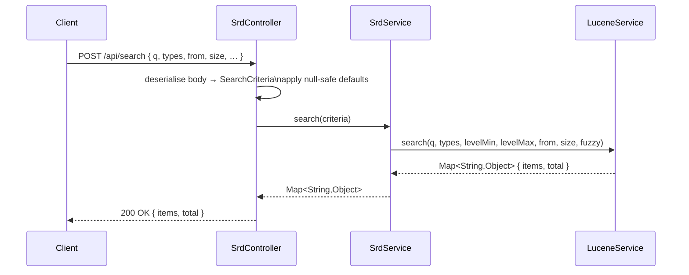
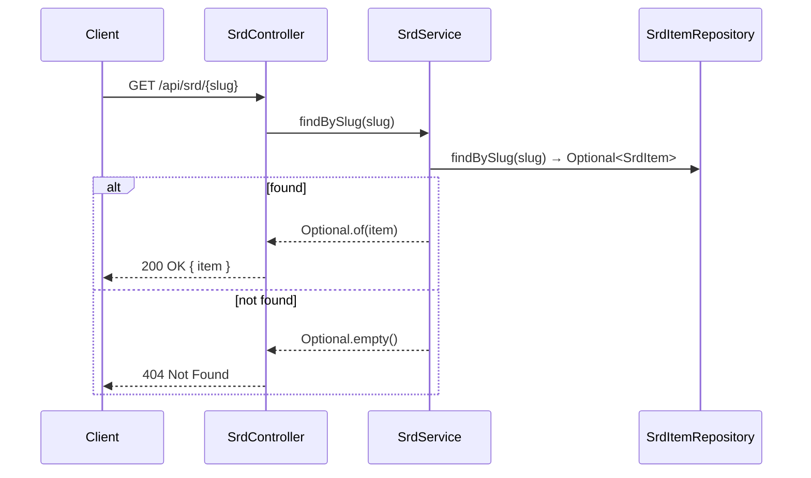
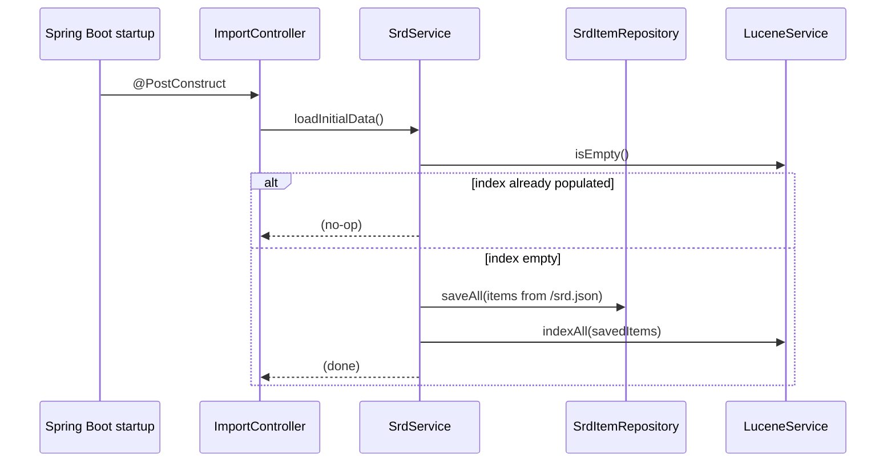

# Flow Descriptor: PBI-002 — Backend Service Layer

> **Status:** Proposed
> **Date:** 2026-05-13
> **Backlog item:** PBI-002
> **ADRs:** None — follows the service layer pattern established in ADR-001 / PBI-001

---

## 1. What This Builds

PBI-002 completes the service layer extraction that PBI-001 started. After this PBI, `SrdController` contains no business logic — it only parses HTTP requests, delegates to `SrdService`, and formats responses. All existing API behaviour is preserved; this is a structural refactoring.

Four specific changes are in scope:

1. **`SrdService.search()`** — absorbs the search delegation and default-value logic currently in `SrdController.search()`
2. **`SrdService.findBySlug()`** — absorbs the slug lookup currently calling the repository directly from the controller
3. **`SrdService.listTypes()`** — absorbs the type enumeration currently in `SrdController.types()`
4. **`ImportController` → delegates to `SrdService.loadInitialData()`** — the startup data-loading logic currently calls the repository and Lucene directly; it must delegate through the service layer

Two clean-ups also in scope:
- `IndexController` — reads JSON titles into a `List<String>` that is never used anywhere; dead code; deleted
- `SrdController` — after extraction, drops its `SrdItemRepository` and `LuceneService` fields entirely, injecting only `SrdService`

---

## 2. Component Map

| Component | Status | Change |
|---|---|---|
| `SrdController` | Modified | Drops `SrdItemRepository` + `LuceneService` fields; all handler methods delegate to `SrdService` |
| `SrdService` | Modified | Adds `search()`, `findBySlug()`, `listTypes()`, `loadInitialData()` |
| `ImportController` | Modified | `@PostConstruct` body reduced to a single `srdService.loadInitialData()` call |
| `IndexController` | **Deleted** | Dead code — reads JSON titles into an unused local list |
| `SearchDTO` | Moved | Moved from `com.dhsrd.web` to `com.dhsrd.domain` (renamed `SearchCriteria`); no HTTP annotations, pure data record — belongs in the domain layer |

---

## 3. Data Flow

### Search

**Default application:** null-safe defaults for `from`, `size`, `fuzzy` are applied in `SrdService.search()`, not in the controller. The controller passes the `SearchCriteria` record as-is.

### Slug lookup

**Return type:** `SrdService.findBySlug()` returns `Optional<SrdItem>`. The controller maps absence to 404. This follows the coding guideline ("Use `Optional<T>` for values that may be absent") and keeps the 404 decision in the controller where HTTP concerns belong.

### Startup data loading

**JSON parsing:** The responsibility for reading and parsing `/srd.json` from the classpath moves into `SrdService.loadInitialData()`. `ImportController` retains `@PostConstruct` but contains only `srdService.loadInitialData()`.

---

## 4. API Contract

No changes. All six endpoints retain their paths, methods, request shapes, response shapes, and HTTP status codes. This is a zero-contract-change refactoring.

---

## 5. Security Notes

- No new endpoints introduced. No auth changes.
- Removing the direct `SrdItemRepository` reference from `SrdController` tightens the architectural boundary — the controller can no longer accidentally bypass service-layer sanitisation by calling the repository directly. This is a security improvement, not a regression.
- `SrdService.loadInitialData()` reads from a classpath resource (`/srd.json`), not from user input. No sanitisation is required for the initial load path. If `_bulkUpsert` is used to update content post-load, PBI-001's sanitisation still applies.
- Security Agent exemption: PBI-002 touches no auth, no new endpoints, no user-provided input to persistence. Pass 1 and Pass 2 will be abbreviated confirmation passes, not full reviews.

---

## 6. Consistency Notes

**Follows established pattern from ADR-001 / PBI-001:** The `SrdService` constructor-injection pattern, `@Transactional` on write methods, and `IllegalStateException` wrapping for infrastructure failures are all in place. PBI-002 extends the same class.

**`SearchCriteria` package:** Moving the record from `com.dhsrd.web` to `com.dhsrd.domain` is necessary because `SrdService` must not import from the web layer. The record has no HTTP annotations and is pure data — it belongs in the domain. Jackson can deserialise JSON directly into a `com.dhsrd.domain.SearchCriteria` record; no mapping layer is needed.

**Controller package naming:** The coding guidelines specify `api/` as the controller package name. The existing codebase uses `com.dhsrd.web`. Renaming the package is a cross-cutting change that is out of scope for this structural refactoring. The deviation is acknowledged; a future increment may align the package name, which would require a rename across all imports.

**DIP deviation acknowledged:** The coding guidelines state the domain should not depend on infrastructure directly. `SrdService` calls `SrdItemRepository` (a Spring Data JPA interface) and `LuceneService` (a Spring `@Service`). Both are interfaces from the domain's perspective, but they carry JPA and Lucene annotations in their implementation. Strict DIP would require defining `SrdRepositoryPort` and `SearchPort` interfaces in the domain and having infrastructure adapters implement them. This is out of scope for this increment — the project is small, the coupling is low-risk, and the indirection would add significant boilerplate with no near-term benefit. This is an acknowledged deviation. A future ADR may revisit it if the project grows or if testing friction increases.

**`IndexController` deletion:** The class exists but its `ITEMS` field is never read. Deleting it removes dead code. No other class depends on it.
