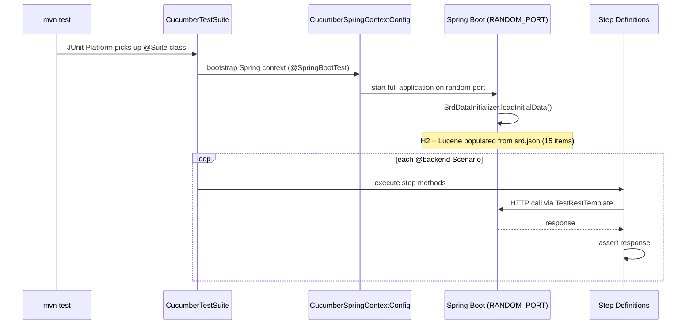

# Flow Descriptor: PBI-003 — Backend Test Infrastructure

> **Status:** Proposed
> **Date:** 2026-05-13
> **Backlog item:** PBI-003
> **ADRs:** ADR-003 — Cucumber JVM for backend acceptance testing

---

## 1. What This Builds

PBI-003 wires a Cucumber acceptance test runner into the backend and writes step definitions for all six `@backend` scenarios in `PBI-003-backend-test-infrastructure.feature`. After this PBI:

- `mvn test` runs all existing unit/slice tests **and** the Cucumber acceptance suite in a single command
- All `@backend` scenarios pass; `@frontend` scenarios are skipped (pending PBI-006)
- The test infrastructure is in place for all subsequent PBIs to add step definitions

Four new Maven dependencies are added (all `test` scope). Five new Java source files are added under `src/test/`. No production source files are touched. No API changes.

---

## 2. Component Map

| Component | Status | Change |
|---|---|---|
| `pom.xml` | Modified | Add 4 test-scoped Cucumber dependencies |
| `src/test/resources/features/` | New directory | Feature files for Cucumber runner |
| `src/test/resources/srd.json` | Modified | Expand from 1 item to 15 items (pagination scenario needs ≥11 results) |
| `CucumberTestSuite.java` | New | JUnit Platform Suite runner; tag filter `@backend` |
| `CucumberSpringContextConfig.java` | New | `@SpringBootTest(RANDOM_PORT)` Spring context for Cucumber |
| `CommonStepDefs.java` | New | Background steps (`app running`, `data loaded`) |
| `SearchStepDefs.java` | New | Step definitions for the three search scenarios |
| `SlugLookupStepDefs.java` | New | Step definition for the slug not-found scenario |

---

## 3. Data Flow

### Test execution

### Scenario: Search with blank query returns all results

Step definition sends `POST /api/search` with `{}`. Asserts response contains `"total"` equal to the total item count loaded from `srd.json`.

### Scenario: Search applies fuzzy matching by default

Step definition sends `POST /api/search` with `{"q": "guardin"}`. Asserts at least one result with a title or content matching "guardian". Requires at least one "guardian"-type item in `srd.json`.

### Scenario: Search respects explicit pagination

Step definition sends `POST /api/search` with `{"from": 10, "size": 5}`. Asserts response `items` list has at most 5 entries. Validates that `from` offset is applied by comparing item count (not a specific item order assertion, since Lucene ranking order is non-deterministic across runs with synthetic data).

### Scenario: Service throws a not-found response when slug does not exist

Step definition sends `GET /api/srd/nonexistent-slug`. Asserts `404 Not Found`.

---

## 4. API Contract

No changes. All scenarios exercise existing endpoints:

| Method | Path | Auth | PBI-003 scenarios |
|---|---|---|---|
| `POST` | `/api/search` | None | Search with blank query, fuzzy, pagination |
| `GET` | `/api/srd/{slug}` | None | Slug not-found |

---

## 5. Security Notes

- No new endpoints, no auth changes.
- Acceptance tests that touch admin endpoints (none in PBI-003) would use `httpBasic` with `TEST_ADMIN_PASSWORD` constant + `@TestPropertySource` per the pattern from `SecurityIntegrationTest`.
- The expanded `srd.json` test fixture contains synthetic data only; no real content.
- The Cucumber Spring context uses `@SpringBootTest(webEnvironment = RANDOM_PORT)` — the security filter chain is fully active, so tests exercise the real auth/CORS/headers behaviour.

---

## 6. Consistency Notes

**Follows ADR-003:** Cucumber JVM 7.x with JUnit Platform engine, per the accepted ADR.

**Follows PBI-001/002 test patterns:** `@TestPropertySource` for credentials, constants for test values, no hardcoded credential strings.

**`srd.json` expansion:** The existing file has 1 item. The pagination scenario requires `from: 10` to be meaningful — the fixture must have at least 11 items. Expanding to 15 items covers this. The items are synthetic (ABILITIES type, sequential slugs) and will not be confused with real SRD content.

**Feature file placement:** The canonical `.feature` files live in `dev-flow/product/` (human-readable, version-controlled). The Cucumber runner reads from `src/test/resources/features/` — a separate copy containing only the `@backend` scenarios from PBI-003. As future PBIs add step definitions, their `@backend` scenarios are added to this directory. This keeps the test runtime independent of the dev-flow documentation tree.

**`@frontend` scenario handling:** The Cucumber runner is configured with `tags = "@backend"`. The `@frontend` scenarios in the feature files are not placed in `src/test/resources/features/` yet — they will be added by PBI-006 once the Playwright runner exists. This is the explicit design established when PBI-006 was sequenced before PBI-004/005.

**No `@WebMvcTest` for acceptance tests:** Acceptance tests use `@SpringBootTest(webEnvironment = RANDOM_PORT)`, not `@WebMvcTest`. This is intentional — acceptance tests must exercise the full stack (security filter chain, service layer, Lucene) not a slice. Unit/slice tests continue to use `@WebMvcTest` and `@ExtendWith(MockitoExtension.class)`.
