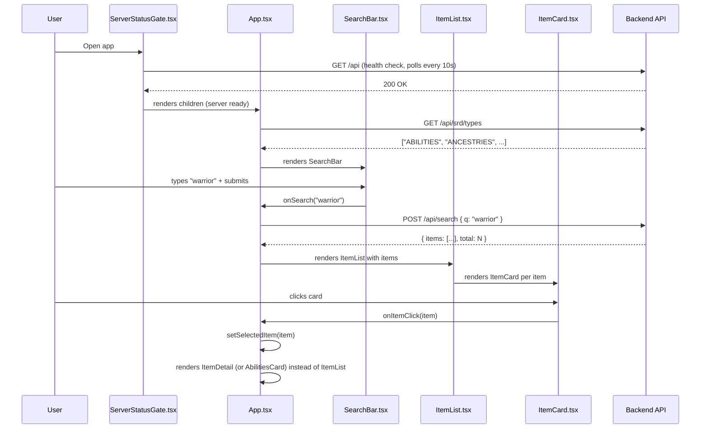

# PBI-004: Frontend TypeScript Migration — Flow Descriptor

> **Backlog item:** PBI-004
> **Date:** 2026-05-13
> **Feature file:** `dev-flow/product/PBI-004-frontend-typescript-migration.feature`
> **ADRs governing this PBI:** ADR-006, ADR-007, ADR-008

---

## 1. What This Builds

PBI-004 migrates all eleven JavaScript source files in `frontend/src/` to TypeScript. There are no new features and no behaviour changes. The application must build and run identically before and after.

The migration has three mechanical steps:
1. Rename files from `.js` to `.ts`/`.tsx` (all files contain JSX, so all become `.tsx` except `index` — which also contains JSX and becomes `.tsx`)
2. Add a `tsconfig.json` and `@types/` dev dependencies
3. Add explicit TypeScript types (prop interfaces, return types, API response shapes) and fix any strict-mode errors surfaced by the compiler

The feature file's acceptance scenarios are:
- `tsc --noEmit` exits with code 0, zero type errors
- `npm run build` (CRA production build) completes without errors
- All four `@regression @frontend` scenarios pass (application behaviour is identical post-migration)

---

## 2. Component Map

All components are **modified** (file rename + typing). No new components. No backend changes.

| File (before) | File (after) | Change type |
|---|---|---|
| `frontend/src/index.js` | `frontend/src/index.tsx` | Rename + add `ReactDOM.createRoot` types |
| `frontend/src/App.js` | `frontend/src/App.tsx` | Rename + add prop interface + remove unused `use` import |
| `frontend/src/components/SearchBar.js` | `frontend/src/components/SearchBar.tsx` | Rename + add prop interface |
| `frontend/src/components/ItemList.js` | `frontend/src/components/ItemList.tsx` | Rename + add prop interface + item type |
| `frontend/src/components/ItemCard.js` | `frontend/src/components/ItemCard.tsx` | Rename + add prop interface + item type |
| `frontend/src/components/ItemDetail.js` | `frontend/src/components/ItemDetail.tsx` | Rename + add prop interface + item type |
| `frontend/src/components/AbilitiesCard.js` | `frontend/src/components/AbilitiesCard.tsx` | Rename + add prop interface + item type |
| `frontend/src/components/ServerStatusGate.js` | `frontend/src/components/ServerStatusGate.tsx` | Rename + add prop interface + `children: React.ReactNode` |
| `frontend/src/components/TypeMenu.js` | `frontend/src/components/TypeMenu.tsx` | Rename + add prop interface |
| `frontend/package.json` | `frontend/package.json` | Add `@types/react`, `@types/react-dom`, `@types/react-kofi-button` to `devDependencies` |
| _(new)_ | `frontend/tsconfig.json` | New file — governs TypeScript compiler (see ADR-006) |

---

## 3. Data Flow

The application's data flow is **unchanged** by this migration. The TypeScript migration is a compile-time transformation only — no runtime behaviour is added, removed, or modified.

The existing flow for the primary use case (user searches for an item):



This sequence is identical pre- and post-migration. TypeScript adds compile-time contracts to each arrow but does not alter the runtime behaviour.

---

## 4. API Contract

No new or changed endpoints. All API calls are existing:

| Call site | Method | Path | Notes |
|---|---|---|---|
| `ServerStatusGate.tsx` | GET | `/api` | Health poll — 200 = ready |
| `App.tsx` | GET | `/api/srd/types` | Fetch type list for TypeMenu |
| `App.tsx` | POST | `/api/search` | Search and URL-pattern-based item load |

No contract changes. The migration adds TypeScript interfaces to describe the response shapes but does not alter the wire format.

---

## 5. Shared Types

The migration should introduce a `frontend/src/types/index.ts` file to hold shared domain types used across multiple components:

```typescript
// Represents a single SRD item returned by the search API
export interface SrdItem {
  id: string;
  slug: string;
  title: string;
  type: string;
  content: string;
  excerpt?: string;
  level?: string | number;
  recallCost?: string | number;
  subtype?: string;
}

// Represents the API search response envelope
export interface SearchResponse {
  items: SrdItem[];
  total: number;
}
```

`App.tsx`, `ItemList.tsx`, `ItemCard.tsx`, `ItemDetail.tsx`, and `AbilitiesCard.tsx` all operate on the same item shape and should import `SrdItem` from this shared location rather than redeclaring it per file.

This follows the architecture guideline's "feature-first structure" — types are co-located with the feature they describe and exposed via a central `types/index.ts`.

---

## 6. Known Strict-Mode Issues to Resolve

The following issues exist in the current JavaScript source and will surface as TypeScript compiler errors under `strict: true`. Each must be resolved during the migration (not deferred):

| File | Issue | Resolution |
|---|---|---|
| `App.js` | `import { use } from 'react'` — `use` is imported but unused | Remove the unused import |
| `App.js` | `useEffect(() => { ... }, [])` — `serverUrl` is referenced in the callback but missing from the dep array | Add `serverUrl` to the dependency array |
| `ItemCard.js` | `typeIcons` object has duplicate `weapons` key | Remove one duplicate entry |
| `ItemDetail.js` | Same duplicate `weapons` key | Remove one duplicate entry |
| `AbilitiesCard.js` | Same duplicate `weapons` key | Remove one duplicate entry |
| `ItemList.js` | `import ItemCard from './ItemCard.js'` — `.js` extension in import | Remove the `.js` extension (TypeScript resolves without it) |
| All components | Props are untyped — TypeScript will infer them as implicit `any` | Add `interface` declarations for each component's props |
| `ServerStatusGate.tsx` | `children` prop is untyped | Type as `children: React.ReactNode` |

---

## 7. Security Notes

**No new security surface is introduced by this migration.**

- No new endpoints
- No changes to authentication or authorisation (Spring Security — ADR-001)
- No changes to how user-supplied HTML is rendered (`dangerouslySetInnerHTML` usage in `ItemDetail.tsx` and `AbilitiesCard.tsx` is unchanged; server-side Jsoup sanitisation per ADR-002 remains the protection)
- TypeScript's `strictNullChecks` provides compile-time defence against null-dereference on API response fields — a net improvement in safety over the untyped baseline
- No PII or sensitive data is involved in any component

**Trust boundaries are unchanged:** user input enters through `SearchBar.tsx` → `handleSearch` in `App.tsx` → `POST /api/search`. The backend validates and processes the query; the frontend does not sanitise it. This is the existing design and is unchanged by the migration.

---

## 8. Consistency Notes

This migration follows and is consistent with all existing accepted ADRs:

- **ADR-001** (Spring Security): Frontend has no auth logic — unchanged
- **ADR-002** (HTML sanitisation): `dangerouslySetInnerHTML` usage is preserved exactly; server-side Jsoup sanitisation is unchanged
- **ADR-003** (Cucumber backend tests): Backend is untouched
- **ADR-004** (Vitest component testing): The `vitest.config.js` currently uses a custom esbuild pre-enforce plugin to handle JSX in `.js` files. After the migration renames files to `.tsx`, this workaround may be replaceable with the standard `@vitejs/plugin-react` approach. This is a cleanup opportunity for the implementation agent but not a blocker — the existing config will continue to work with `.tsx` files.
- **ADR-005** (Playwright/Cucumber e2e): The e2e test suite's `AppPage.ts` uses DOM selectors; none of the selectors depend on file extensions. The `REACT_APP_API_URL` env var convention is unchanged. No e2e test changes are required.
- **ADR-006** (TypeScript compiler config): `tsconfig.json` as specified; `strict: true`
- **ADR-007** (CRA + TS integration): File rename approach; `react-scripts` scripts unchanged
- **ADR-008** (Third-party type strategy): `@types/react@^18.3`, `@types/react-dom@^18.3`, `@types/react-kofi-button`

**Architecture guideline compliance:**

- "TypeScript only" hard rule (CLAUDE.md rule 5): Satisfied — all source files will be `.ts`/`.tsx` after migration
- "Dumb components, smart hooks": Existing violations (API calls in `App.js`) are preserved as-is; PBI-004 does not refactor behaviour. PBI-005 (frontend architecture) is the correct PBI to address the architecture guideline violations. This is documented as an out-of-scope note, not fixed here
- "Feature-first structure": The `types/index.ts` addition follows the guideline. The component structure is otherwise unchanged

---

## 9. Out of Scope

The following are explicitly **not** part of PBI-004:

- Migrating the build tool from CRA/Webpack to Vite (deferred to PBI-005 — see ADR-007)
- Refactoring `App.tsx` to separate API calls into hooks (architecture violation — deferred to PBI-005)
- Adding new Vitest component tests or Playwright e2e steps for the migrated components (test stubs exist from PBI-006; full assertions are PBI-005 scope)
- Removing `dangerouslySetInnerHTML` or adding client-side sanitisation (out of scope; ADR-002 governs this)
- Addressing the duplicate `weapons` key beyond removing the redundant entry (it is a harmless JS bug, not a security or type issue)

---

## 👤 Human Review Checklist

- [ ] The component map correctly identifies all files to be changed
- [ ] The shared `SrdItem` interface shape looks correct for the actual API response
- [ ] The "known strict-mode issues" list is complete — no surprises during implementation
- [ ] The "out of scope" section correctly defers behaviour changes to PBI-005
- [ ] The security notes are appropriate for a rename+retype migration
- [ ] I am comfortable with implementation proceeding on this basis

**Decision:** `Approved` / `Rejected — [reason]` / `Needs revision — [what to revisit]`
