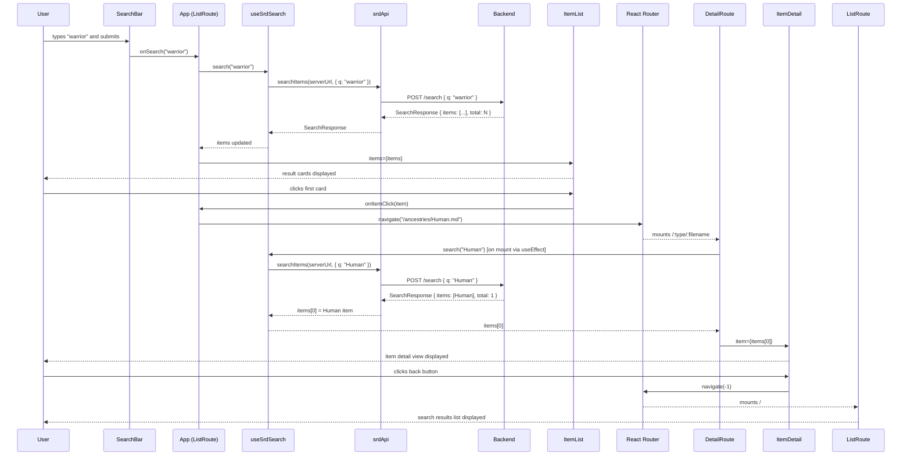
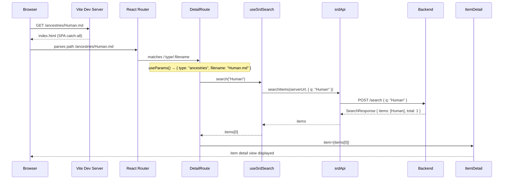

# PBI-005: Frontend Architecture — Flow Descriptor

> **Date:** 2026-05-13
> **Backlog item:** PBI-005
> **ADRs produced:** ADR-009, ADR-010, ADR-011

---

## 1. What This Builds

PBI-005 is the final PBI in the Foundation increment. It introduces no new user-visible features; instead it completes the structural work that makes the codebase compliant with the project's architectural hard rules. Three parallel work streams run in this PBI:

**Stream 1 — Build tool migration (ADR-009):** CRA (`react-scripts`) is replaced by Vite. This was explicitly deferred from PBI-004 per ADR-007. The dev server, production build, and test pipeline all migrate to a unified Vite/esbuild transform path.

**Stream 2 — API service layer and hooks (ADR-010):** `App.tsx` currently contains four `fetch` calls inline. CLAUDE.md hard rule 4 prohibits this. A typed service module (`src/services/srdApi.ts`) and custom hooks (`src/hooks/useSrdTypes.ts`, `src/hooks/useSrdSearch.ts`) are extracted. `App.tsx` becomes a layout and wiring component with no `fetch` calls.

**Stream 3 — React Router URL navigation (ADR-011):** `window.location.pathname` reads are replaced with `<BrowserRouter>` + `useParams()` + `useNavigate()`. The "item detail" view becomes a route (`/:type/:filename`) rather than a state toggle. Direct URL navigation and browser back/forward buttons work correctly.

**Activation work (no ADR required):**
- PBI-005 e2e stubs in `appSteps.ts` are implemented with real Playwright assertions (following ADR-005 Page Object pattern)
- PBI-006 component test stubs (`SearchBar.test.js`, `ItemList.test.js`) are activated with real Vitest assertions
- Test files migrated from `.js` to `.ts` (per ADR-006 TypeScript-only rule)
- Dead `icon?: string` prop removed from `ItemDetailProps` (noted in CLAUDE.md constraints)

---

## 2. Component Map

### Modified components

| Component | Type | Change |
|---|---|---|
| `frontend/index.tsx` | Modified | Add `<BrowserRouter>` wrapper; update `REACT_APP_API_URL` → `VITE_API_URL` reference (none currently, but env var convention changes) |
| `frontend/src/App.tsx` | Modified | Remove all `fetch` calls; remove `window.location.pathname` logic; add `<Routes>` + `<Route>` structure; consume hooks from ADR-010 |
| `frontend/src/components/ItemDetail.tsx` | Modified | Remove dead `icon?: string` prop; `onBack` calls `navigate(-1)` |
| `frontend/src/components/ItemList.tsx` | Modified | `onItemClick` callback in App now calls `navigate()` — prop type unchanged |
| `frontend/vitest.config.js` | Modified → renamed `vitest.config.ts` | Remove dead esbuild JSX workaround; use `@vitejs/plugin-react` directly; update `setupFiles` to `.ts` |
| `frontend/package.json` | Modified | Replace `react-scripts` scripts with `vite` / `vite build`; remove `react-scripts` from dependencies |
| `frontend/tsconfig.json` | Modified | Add `"types": ["vite/client"]` for `import.meta.env` typing |
| `frontend/e2e/pages/AppPage.ts` | Modified | Add `navigateTo(path)`, `waitForItemDetail()`, `waitForSearchResults()`, `clickFirstCard()`, `clickBackButton()`, `clickTypeFilter(type)`, `isDarkModeActive()` methods |
| `frontend/e2e/steps/appSteps.ts` | Modified | Implement all PBI-005 `// TODO PBI-005` stubs with real Playwright assertions |

### New components

| Component | Type | Purpose |
|---|---|---|
| `frontend/vite.config.ts` | New | Vite build + dev server config; `port: 3000` to preserve e2e contract |
| `frontend/index.html` | New (moved) | Root HTML entry point (moved from `public/index.html`; gains `<script type="module" src="/src/index.tsx">`) |
| `frontend/src/services/srdApi.ts` | New | Typed fetch functions: `fetchTypes()`, `searchItems()` |
| `frontend/src/hooks/useSrdTypes.ts` | New | Hook: fetches type list on mount |
| `frontend/src/hooks/useSrdSearch.ts` | New | Hook: exposes `search()`, `filterByType()`, `clearSelection()`; manages `items`, `selectedType`, `loading` |

### Test files migrated to TypeScript

| Old | New |
|---|---|
| `frontend/src/test-setup.js` | `frontend/src/test-setup.ts` |
| `frontend/src/__tests__/SearchBar.test.js` | `frontend/src/__tests__/SearchBar.test.ts` |
| `frontend/src/__tests__/ItemList.test.js` | `frontend/src/__tests__/ItemList.test.ts` |

### Unchanged components

`SearchBar.tsx`, `TypeMenu.tsx`, `AbilitiesCard.tsx`, `ServerStatusGate.tsx`, `ItemCard.tsx`, `e2e/support/world.ts` (except `REACT_APP_API_URL` → `VITE_API_URL` rename).

---

## 3. Data Flow

### Primary flow: user searches for an item and views the detail



### Secondary flow: direct URL navigation



### Dark mode flow (unchanged behaviour, persistence via localStorage)

Dark mode state remains in `App.tsx` as UI state — it is not server state and is not moved to a hook. The existing `localStorage.getItem/setItem('darkMode')` pattern is preserved unchanged. This follows ADR-010's constraint that only server state is extracted to hooks.

---

## 4. API Contract

No new or changed API endpoints. The same three backend endpoints are called with the same request and response shapes:

| Method | Path | Request body | Response | Auth |
|---|---|---|---|---|
| `GET` | `/srd/types` | — | `string[]` | None |
| `POST` | `/search` | `{ q: string }` | `{ items: SrdItem[], total: number }` | None |
| `POST` | `/search` | `{ types: string[] }` | `{ items: SrdItem[], total: number }` | None |

These are now encapsulated in `src/services/srdApi.ts`. The `SearchParams` union type makes the two search call shapes explicit:

```typescript
export type SearchParams = { q: string } | { types: string[] };
```

---

## 5. Security Notes

**Who is authorised:** All routes and API calls are unauthenticated. The SRD content is public. No user authentication is involved (consistent with all prior PBIs).

**Trust boundaries:**

1. **URL parameters (`/:type/:filename`)**: User-controllable via the browser address bar. The `filename` parameter is decoded (`decodeURIComponent`) and the `.md` suffix stripped before use as a Lucene search term. The value is sent as a JSON body field to the backend, not interpolated into a URL path. The security agent should review whether the backend Lucene query handler applies input sanitisation to the `q` field — this risk pre-dates PBI-005 but is now more visible because URL-driven search is explicit.

2. **Environment variable `VITE_API_URL`**: Not user-controllable. Only variables prefixed `VITE_` are exposed in the browser bundle by Vite (ADR-009). The production URL is hardcoded in `index.tsx`; `VITE_API_URL` is an override used in test context only.

3. **`dangerouslySetInnerHTML` in `ItemDetail.tsx`**: Unchanged. The backend sanitises HTML content via Jsoup `Safelist.basic()` (ADR-002). The frontend rendering is not modified by PBI-005.

**Where checks are enforced:** No permission checks are required (public content). Input sanitisation for the search query is the backend's responsibility (ADR-002 / backend service layer).

**Sensitive data:** None. SRD content is public domain reference material.

---

## 6. Consistency Notes

| Decision | ADR reference |
|---|---|
| Vite migration follows the deferred plan from ADR-007 | ADR-007, ADR-009 |
| API service module satisfies CLAUDE.md hard rule 4 | ADR-010 |
| Custom hooks pattern satisfies architecture guidelines "dumb components, smart hooks" | ADR-010 |
| `BrowserRouter` + `useParams` follows React Router's established pattern; no new library | ADR-011 |
| TypeScript-only test files follow ADR-006 "strict: true, TypeScript only" | ADR-006 |
| Page Object pattern in e2e tests follows ADR-005 ("no raw selectors in step definitions") | ADR-005 |
| Component test activation (SearchBar, ItemList) follows the Vitest + RTL pattern from ADR-004 | ADR-004 |
| No new runtime dependencies introduced | — |

### Deviations

None. All decisions are within established ADR constraints or are the subject of a new ADR in this PBI.

---

## 7. Implementation Checklist (for the Implementation Agent)

The following tasks must all be complete before PBI-005 is considered done. Tasks are ordered by dependency.

**Build tool (ADR-009):**
- [ ] Create `frontend/vite.config.ts` with `@vitejs/plugin-react`, `server: { port: 3000 }`, `build: { outDir: 'dist' }`
- [ ] Move `frontend/public/index.html` to `frontend/index.html`; add `<script type="module" src="/src/index.tsx">` entry point tag; remove CRA-specific `%PUBLIC_URL%` references
- [ ] Update `package.json` scripts: `start` → `vite`, `build` → `vite build`; add `preview` → `vite preview`
- [ ] Remove `react-scripts` from `dependencies` (or move to devDependencies if needed for any remaining use — expected: none)
- [ ] Rename `vitest.config.js` → `vitest.config.ts`; remove dead esbuild JSX plugin; use `import react from '@vitejs/plugin-react'`; update `setupFiles` to `./src/test-setup.ts`
- [ ] Add `"types": ["vite/client"]` to `tsconfig.json` compilerOptions
- [ ] Rename `REACT_APP_API_URL` → `VITE_API_URL` in `world.ts`
- [ ] Verify `npm start` starts on port 3000; `npm run build` produces `dist/`; `npm test` passes; `npm run test:e2e` passes

**API service layer (ADR-010):**
- [ ] Create `frontend/src/services/srdApi.ts` with `fetchTypes()` and `searchItems()`; export `SearchParams` type
- [ ] Create `frontend/src/hooks/useSrdTypes.ts`
- [ ] Create `frontend/src/hooks/useSrdSearch.ts` with `search()`, `filterByType()`, `clearSelection()` functions
- [ ] Refactor `App.tsx` to consume hooks; remove all inline `fetch` calls
- [ ] Remove dead `icon?: string` prop from `ItemDetailProps` in `ItemDetail.tsx`

**React Router (ADR-011):**
- [ ] Add `<BrowserRouter>` wrapper in `index.tsx` (outside `ServerStatusGate`)
- [ ] Add `<Routes>` + `<Route path="/" element={...}>` + `<Route path="/:type/:filename" element={...}>` in `App.tsx`
- [ ] Replace `window.location.pathname` block in `App.tsx` with `useParams()` in the detail route
- [ ] Replace `setSelectedItem(item)` on card click with `useNavigate()` push to `/:type/:filename`
- [ ] Replace `onBack={() => setSelectedItem(null)}` with `navigate(-1)` in `ItemDetail.tsx`
- [ ] Verify Vite dev server serves `index.html` for all paths (SPA catch-all — Vite does this by default)

**Test activation:**
- [ ] Migrate `test-setup.js` → `test-setup.ts`
- [ ] Migrate `SearchBar.test.js` → `SearchBar.test.ts`; implement real RTL assertions
- [ ] Migrate `ItemList.test.js` → `ItemList.test.ts`; implement real RTL assertions
- [ ] Extend `AppPage.ts` with: `navigateTo(path)`, `waitForItemDetail()`, `waitForSearchResults()`, `clickFirstCard()`, `clickBackButton()`, `clickTypeFilter(type)`, `enableDarkMode()`, `reloadPage()`, `isDarkModeActive()`
- [ ] Implement all `// TODO PBI-005` step stubs in `appSteps.ts` with real Playwright assertions
- [ ] All 5 PBI-005 scenarios (`@smoke` and `@regression`) must pass in `npm run test:e2e`
- [ ] `npm test` (Vitest) passes with 0 failures

---

## Notes

- The `ServerStatusGate` component polls `GET /api` before rendering the `App`. The `<BrowserRouter>` wrapper is placed outside `ServerStatusGate` in `index.tsx` so the router is active regardless of server status — this ensures `useParams()` is available even if the gate is showing a loading/error state.
- Vercel deployment: the `vercel.json` may need a rewrite rule `{ "rewrites": [{ "source": "/(.*)", "destination": "/index.html" }] }` for client-side routing to work on direct URL load in production. Check whether this is already configured.
- The `world.ts` `page.route()` mocks for `**/api/search` and `**/api/srd/types` remain valid after the refactor — Playwright intercepts at the network layer regardless of which module makes the fetch call.
