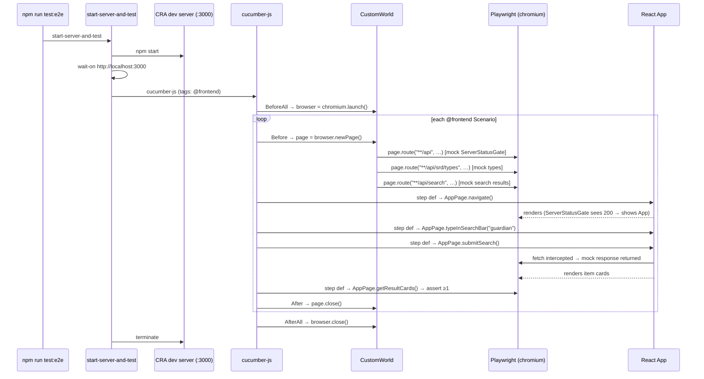

# Flow Descriptor: PBI-006 — Frontend Test Infrastructure

> **Status:** Proposed
> **Date:** 2026-05-13
> **Backlog item:** PBI-006
> **ADRs:** ADR-004 (Vitest + RTL), ADR-005 (Playwright + Cucumber JS)

---

## 1. What This Builds

PBI-006 wires two test runners into the frontend and writes stubs or real step definitions for all eight `@frontend` scenarios. After this PBI:

- `npm test` runs all Vitest component tests (two files, four test cases — stubs for the @regression scenarios)
- `npm run test:e2e` starts the CRA dev server and runs the full Cucumber JS + Playwright suite
- All `@frontend` scenarios pass
- The test infrastructure is in place for PBI-004 and PBI-005 to add real component assertions

No production source files are touched. No API changes. The `@regression` component tests are deliberately stub implementations per the explicit note in the feature file — they pass trivially and are labelled with `// TODO PBI-005` comments to be activated when the component contracts are finalised.

---

## 2. Component Map

| Component | Status | Change |
|---|---|---|
| `package.json` | Modified | Add Vitest + RTL dev deps; add Playwright + Cucumber JS dev deps; add `test` and `test:e2e` scripts |
| `vitest.config.js` | New | Vitest configuration: jsdom env, `@vitejs/plugin-react`, setup file |
| `src/test-setup.js` | New | Imports `@testing-library/jest-dom` to extend Vitest matchers |
| `src/__tests__/SearchBar.test.js` | New | 2 stub component tests for SearchBar (PBI-005 activates real assertions) |
| `src/__tests__/ItemList.test.js` | New | 2 stub component tests for ItemList (PBI-005 activates real assertions) |
| `cucumber.js` | New | Cucumber JS config: feature paths, glue, tag filter, ts-node loader |
| `e2e/support/world.ts` | New | `CustomWorld` holding `browser`, `page`, and `consoleErrors` |
| `e2e/pages/AppPage.ts` | New | Page Object for the main app UI |
| `e2e/steps/appSteps.ts` | New | Step definitions for all `@frontend` scenarios |

---

## 3. Data Flow

### Component test (Vitest)

```
npm test
  └── vitest run
         └── src/__tests__/SearchBar.test.js
                └── render(<SearchBar onSearch={mockFn} />)
                       └── assertions [stub: trivially pass]
```

### E2e acceptance test (Playwright + Cucumber JS)



---

## 4. API Contract

No changes. All e2e tests use `page.route()` mocking — no real API calls are made.

---

## 5. Security Notes

- No new endpoints. No auth changes.
- All new packages are `devDependencies` — excluded from the production bundle.
- The hardcoded production URL in `index.js` (`https://daggerheart-tools-4v1t.onrender.com/api`) is intercepted by `page.route()` during tests. The production server is not contacted during the test run.
- Mock responses contain synthetic data only.
- Security Agent PBI-006 note: no trigger criteria met — no auth, no user input to persistence, no new endpoints. Abbreviated confirmation pass.

---

## 6. Consistency Notes

**`@regression` stubs are intentional**: The feature file contains an explicit note: "@regression coverage scenarios (SearchBar, ItemList) are written against the final component contracts and will be implemented as stubs that pass trivially during PBI-006; full coverage is activated when PBI-004 and PBI-005 complete the components they test." All stub test methods carry `// TODO PBI-005: replace stub with real assertion` comments.

**TypeScript e2e step defs in a JavaScript app**: The coding guidelines mandate TypeScript for all new code. The app is JavaScript until PBI-004. E2e step defs and support files are `.ts` (compiled at test time via `ts-node`). The Vitest component tests remain `.js` to match the component files they test — this is the established React convention (test file extension matches source file extension). When PBI-004 migrates the app to TypeScript, tests become `.tsx`/`.ts`.

**Page Object pattern**: All Playwright selectors live in `e2e/pages/AppPage.ts`. Step definitions call only `AppPage` methods. No raw `page.$()` or `page.locator()` calls appear in step definition files.

**Feature file location**: Cucumber JS is configured to read from `dev-flow/product/*.feature` with tag filter `@frontend`. This avoids duplicating feature files and keeps the `dev-flow/product/` directory as the single source of truth.

**`start-server-and-test` vs manual server management**: `start-server-and-test` handles server startup, readiness polling, and teardown in a single dependency. This satisfies the "no manual setup" CI requirement without bespoke scripts.

**Current CRA dev server start time**: CRA's `npm start` takes 10–30 seconds. `start-server-and-test` uses `wait-on` to poll `http://localhost:3000` before launching Cucumber. The CI job should budget ~60 seconds for this warm-up.

**SearchBar "empty submit" scenario — current vs future behaviour**: The current `SearchBar.js` calls `onSearch(query)` unconditionally on form submit, including for empty strings. The scenario "SearchBar does not call the search callback on empty submission" tests a future guard that will be added in PBI-005. The stub implementation passes trivially; when PBI-005 adds the guard, the stub is replaced with a real assertion.
