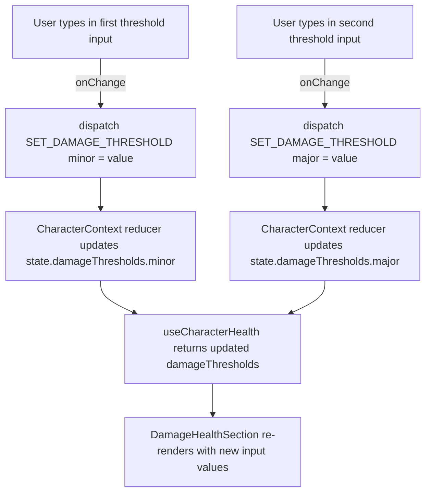

# Flow Descriptor — PBI-022: Damage thresholds as inline 2-input row in Damage and Health section

**PBI:** PBI-022
**ADR required:** No — the `DamageThresholds` type is local frontend state within the character-sheet feature (not persisted, not shared via API, not a database schema). Reducing it from three fields to two is a contained state shape change within the existing ADR-012 (Character Sheet State Management) context. No new patterns, no new dependencies, no API changes.

---

## 1. What This Builds

Replaces the three stacked damage threshold rows in `DamageHealthSection` with a single inline row: `Minor Damage → [input] → Major Damage → [input] → Severe Damage`. The `severe` field is removed from the `DamageThresholds` type and all associated state, reducer, and hook code. The component renders the inline row with two number inputs and three static label spans, styled to sit on one line with flex layout.

Acceptance scenarios covered: all 6 scenarios in `PBI-022-damage-thresholds-inline.feature`.

---

## 2. Component Map

| Component | Change | Notes |
|---|---|---|
| `DamageHealthSection.tsx` | Modified | Replaces three `threshold-row` divs with a single `.damage-health-section__thresholds-inline` flex row |
| `character.ts` | Modified | `DamageThresholds` type: removes `severe` field → `{ minor: number \| null; major: number \| null }` |
| `CharacterContext.tsx` | Modified | Initial state removes `severe`; `SET_DAMAGE_THRESHOLD` reducer removes `severe` case |
| `useCharacterHealth.ts` | Modified | Removes `damageThresholds.severe` from returned value |
| `App.css` | Modified | Adds `.damage-health-section__thresholds-inline` flex row styles |

No new components. No backend changes.

---

## 3. Data Flow

**State shape change:**

Before: `damageThresholds: { minor: number | null; major: number | null; severe: number | null }`  
After: `damageThresholds: { minor: number | null; major: number | null }`

The `severe` field is removed entirely. No migration is required since the character sheet state is ephemeral (not persisted to backend or localStorage).

---

## 4. API Contract

No API changes. Character sheet state is entirely client-side.

---

## 5. Security Notes

No security implications. The two inputs accept `type="number"` values only. No data crosses a trust boundary — the values are never sent to the backend. `aria-label` attributes are required on both inputs per the design spec (accessibility, not security).

---

## 6. Consistency Notes

- **State update pattern:** `dispatch(SET_DAMAGE_THRESHOLD, { field, value })` follows the same action dispatch pattern used for all other character sheet state mutations in `CharacterContext.tsx`. No deviation from ADR-012.
- **Inline flex row:** The `.damage-health-section__thresholds-inline` layout (flex row, align-items center, gap 0.5rem) is a straightforward CSS addition. No new layout pattern.
- **Removing a state field:** Dropping `severe` from `DamageThresholds` is the correct approach — storing a value that is never displayed or edited is dead state. Since the character sheet has no persistence layer, there is no migration risk.
- Follows ADR-012 (Character Sheet State Management) — reducer and dispatch pattern unchanged; only the state shape shrinks.
